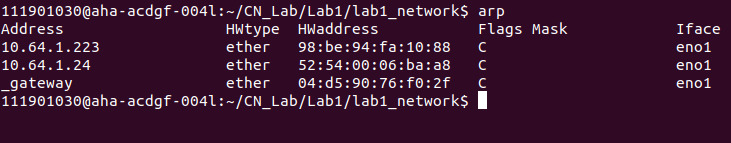
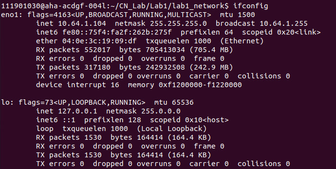
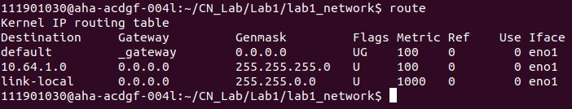
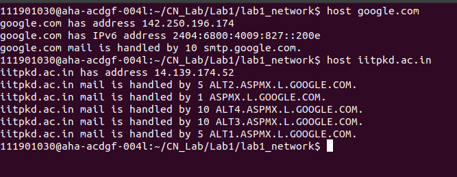
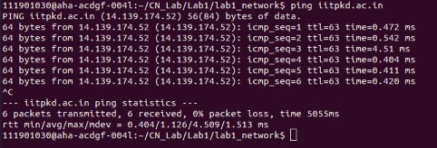
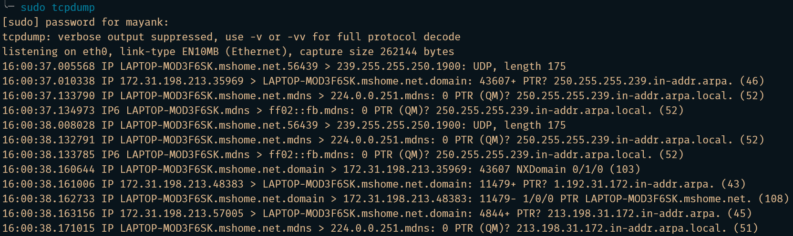
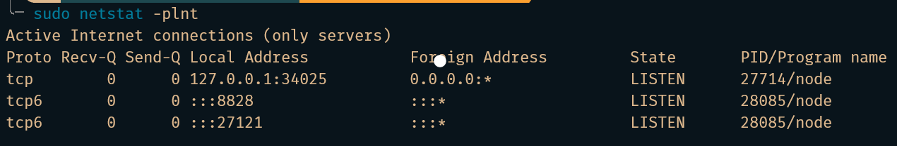
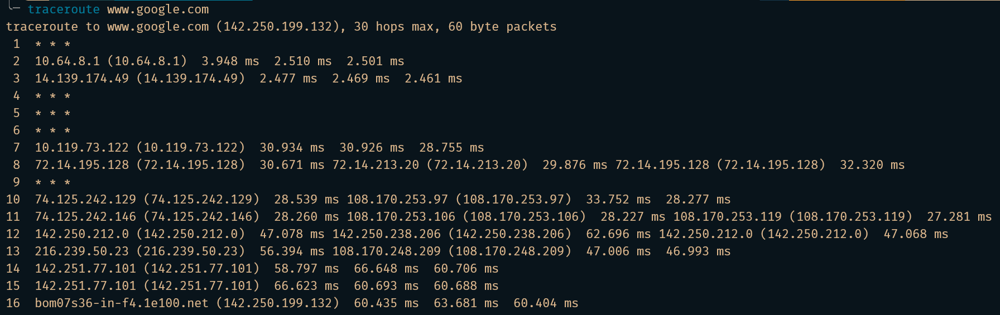
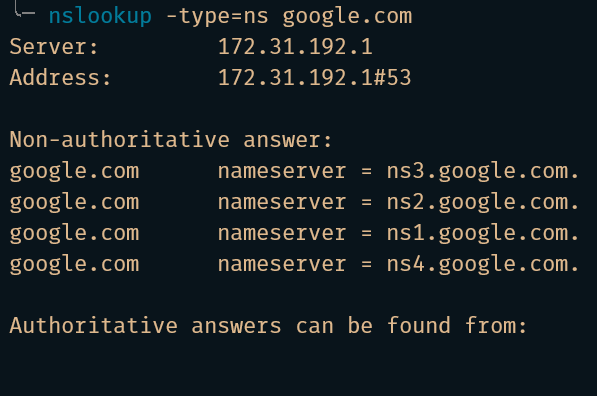
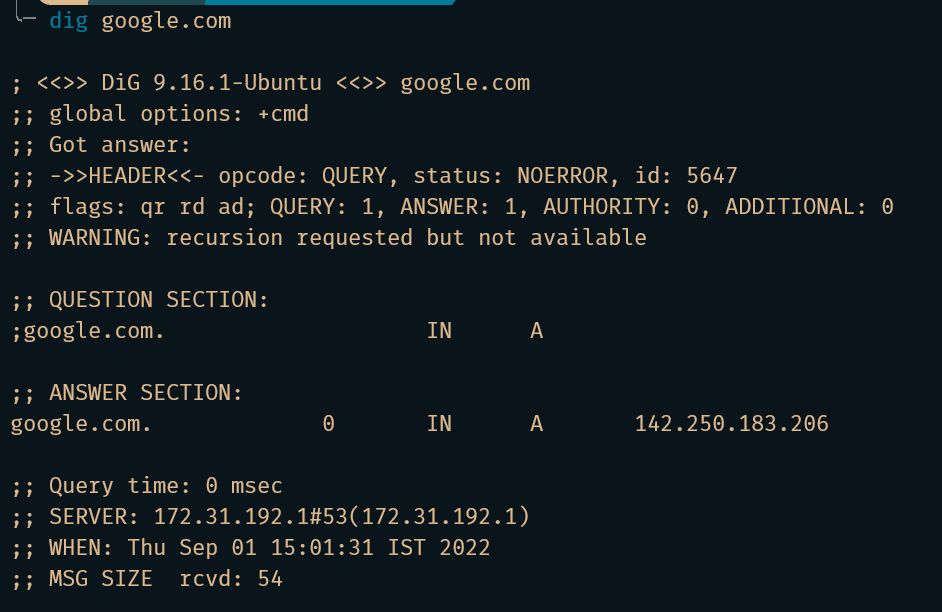

- [IP Address](#ip-address)
- [Subnets](#subnets)
- [Port](#port)
- [MAC address](#mac-address)
- [DNS](#dns)
- [Useful Commands](#useful-commands)
  - [arp](#arp)
  - [ifconfig](#ifconfig)
  - [route](#route)
  - [host](#host)
  - [ping](#ping)
  - [tcpdump](#tcpdump)
  - [netstat](#netstat)
  - [traceroute](#traceroute)
  - [nslookup](#nslookup)
  - [dig](#dig)

# IP Address

-   Every host and router on the Internet has an IP address that can be used in the **Source address** and **Destination address** fields of IP packets
-   An IP address does not actually refer to a host. It really refers to a network interface, so if a host is on two networks, it must have two IP addresses.
    -   Most hosts are on one network and thus have one IP address. In contrast, routers have multiple interfaces and thus multiple IP addresses.

# Subnets

-   Network numbers are managed by a nonprofit corporation called **ICANN (Internet Corporation for Assigned Names and Numbers)**, to avoid conflicts. In turn, ICANN has delegated parts of the address space to various regional authorities, which dole out IP addresses to ISPs and other companies. This is the process by which a company is allocated a block of IP addresses.
-   The process to allow the block of addresses to be split into several parts for internal use as multiple networks, while still acting like a single network to the outside world. This is called **subnetting** and the networks (such as Ethernet LANs) that result from dividing up a larger network are called **subnets**.

# Port

-   A **port** is a number assigned to uniquely identify a connection endpoint and to direct data to a specific service.
-   A port is identified for each transport protocol and address combination by a 16-bit unsigned number, known as the **port number**.
-   A port number is always associated with an IP address of a host and the type of transport protocol used for communication.
-   The practice of attempting to connect to a range of ports in sequence on a single host is commonly known as **port scanning**
-   Port numbers allow different applications on the same computer to share network resources simultaneously.

# MAC address

-   A media access control address (MAC address) is a unique identifier assigned to a network interface controller (NIC) for use as a network address in communications within a network segment.
-   As typically represented, MAC addresses are recognizable as six groups of two hexadecimal digits, separated by hyphens, colons, or without a separator.
-   Network nodes with multiple network interfaces, such as routers and multilayer switches, must have a unique MAC address for each NIC in the same network.
    -   However, two NICs connected to two different networks can share the same MAC address.

# DNS

-   High-level, readable names were introduced in order to decouple machine names from machine addresses.
-   Some mechanism is required to convert the names to network addresses.
-   Domain Name System (DNS) was invented for naming these.
-   To map a name onto an IP address, an application program calls a library procedure called the **resolver**, passing it the name as a parameter. The resolver sends a query containing the name to a local DNS server, which looks up the name and returns a response containing the IP address to the resolver, which then returns it to the caller.
-   If the domain being sought falls under the jurisdiction of the name server, such as `top.cs.vu.nl` falling under `cs.vu.nl`, it returns the authoritative resource records. An **authoritative record** is one that comes from the authority that manages the record and is thus always correct.
    -   Every organization with publicly accessible hosts (such as Web servers and mail servers) on the Internet must provide publicly accessible DNS records that map the names of those hosts to IP addresses. An organization’s authoritative DNS server houses these DNS records.

# Useful Commands

## arp

-   The `arp` command displays the **ARP (Address Resolution Protocol)** table in the memory which is created by the kernel
-   The primary use of ARP is to convert an interface's IPv4 address to the device's MAC (Media Access Control) address
-   For this purpose the kernel maintains an ARP table with the map between several IPv4 addresses of the interfaces in the subnet and the corresponding MAC addresses of the devices in the same subnet
-   The ARP table can be found at `/proc/net/arp`

```sh
arp
# Print the current contents of the table

arp -d <ip_addr>
arp -d <hostname>
# Deletes an entry from the ARP table with IP address corresponding
# to the address (Hostname will be resolved to IP address)

arp -s <ip_addr> <hw_addr>
arp -s <hostname> <hw_addr>
# Inserting a new table entry with IP address corresponding
# to address and the MAC address corresponding to hw_addr.
```



-   **Address** Column corresponds to the IPv4 address of an interface in the subnet
-   **HWtype** refers to the interface type
-   **HWaddress** refers to the MAC address
-   **Iface** refers to the name of the interface.

## ifconfig

-   **Interface Configuration**
-   This command is used to display the status of the running/active interfaces
-   This command is additionally used during the system boot up to initialize interfaces

```sh
ifconfig -a
# Displays all the available interfaces, even if down

ifconfig <interface>
# Displays the status of the interface whose name matches with the
# interface name given in the command.

ifconfig <interface> <up/down>
# Activate/Deactivate the driver for the given interface

ifconfig <interface> <add/del> <ip_addr>
# Used to add/remove an IPv6 address to an interface
```



-   The IP address of the interface is described by the `inet` field
-   The MAC address of the interface is described by the `HWaddr` field

## route

-   IP routing table is created by the kernel to map the topology of the network it is in
-   Some automated procedures in the kernel help building the IP routing table
-   The main use of the `route` command is to add static routes into the IP routing table and also to display the IP routing table
-   **Static routes** are the routes that are not discovered by the kernel because they are not part of the network

```sh
route
# Display the routing table entries

sudo route add <name> <gateway> <ip_addr>
# For adding a static route to the IP routing table

sudo route del <name>
# Deleting the static route from the IP routing table
```



-   The routing table consists of the destination address for each of the interfaces it is connected to hence getting the overall **network topology**

## host

-   The `host` command is used for performing Domain Name System (DNS) lookups. DNS converts a domain name into the IP address of the corresponding interface
-   `host` command is also used for performing reverse DNS lookups i.e converting the IP address of the interface into the domain name of the host it is connected to

```sh
host <hostname>
# Displays IP address associated with the corresponding domain name

host <ip_addr>
# Reverse DNS lookup
# Displays the name of the host corresponding to the IP address.
```



## ping

-   This command is used to test if a device in the network is reachable or not
-   The `ping` command sends a request over the network to the corresponding device and upon successful ping, the corresponding device sends back a response indicating that the ping was successful and the device is reachable in the network

```sh
ping google.com
# Press Ctrl + C to stop pinging

ping -c 5 google.com
# Controlling the number of pings

ping -c 5 -q google.com
# Get only summary

ping -w 3 google.com
# Timeout ping after sometime
```



## tcpdump

-   This command prints out the details about the live packets that are passing through the network interface
-   It filters the packets and prints out only a selected few which satisfy a specific boolean condition

```sh
sudo tcpdump
# Capture the packets of current network interface

sudo tcpdump -i <interface>
# Prints out the packets received by the interface

sudo tcpdump -n -i wlo1
# Capture the packets with IP addresses

sudo tcpdump -D
# Checks all the available interfaces for tcpdump
```



## netstat

-   **Network Statistics**
-   `netstat` is a command that is used to display the network connections, routing tables, and other network statistics
-   This is mainly used for finding the amount of traffic on the network for performance measurements

```sh
netstat -a
# Show both listening and non-listening ports

netstat -l
# Lists all the listening ports

netstat -s
# Display summary statistics for each protocol

netstat -plnt
# Display the ports on which services are running
```



## traceroute

-   Prints the route that a packet takes to reach the host
-   It is useful when we want to know about the route and about all the hops that a packet takes

```sh
traceroute <hostname>

traceroute -g <gateway> <hostname>
# Route the packet through the gateway

traceroute -i <interface> <hostname>
# Route the packet through the interface
```



-   The first column corresponds to the hop count
-   The second column represents the address of that hop
-   `traceroute` command sends three packets to the hop, the 3 space-separated time in milliseconds refers to the time taken by each packet to reach the hop

## nslookup

-   **Name Server Lookup**
-   Used to get information from the DNS server
-   Tool for querying the DNS to obtain domain name or IP address mapping or any other specific DNS record
-   Also used to troubleshoot DNS-related problems

```sh
nslookup <hostname>
# Displays IP address associated with the corresponding domain name

nslookup <ip_addr>
# Reverse DNS lookup
# Displays the name of the host corresponding to the IP address.

nslookup -type=any <hostname>
# Look for any record

nslookup -type=soa <hostname>
# Look for an SOA (Start of Authority) record
# Provides the authoritative info of the domain

nslookup -type=ns <hostname>
# Look for an NS (Name Server) record
# NS maps a domain name to a list of DNS servers authoritative for that domain

nslookup -type=a <hostname>
# Look for an A (address) record

nslookup -type=mx <hostname>
# Look for an MX (Mail Exchange) record
# MX record maps a domain name to a list of mail exchange servers for that domain

nslookup -type=txt <hostname>
# TXT records are useful for multiple types of records like DKIM, SPF, etc.
```



## dig

-   **Domain Information Groper**
-   Used for retrieving information about DNS name servers
-   Used for verifying and troubleshooting DNS problems and to perform DNS lookups
-   It replaces older tools such as `nslookup` and `host`

```sh
dig <hostname>
# DNS Lookup
# Query domain "A" (address) record

dig -x <hostname>
# Reverse DNS Lookup

dig <hostname> +short
# Display only IP address of the domain name

dig <hostname> all
# Query all DNS record types for the domain

dig <hostname> soa
# Query for SOA (Start of Authority) record for the domain

dig <hostname> nx
# Query for NS (Name Server) record for the domain

dig <hostname> mx
# Query for MX (Mail Exchange) record for the domain

dig <hostname> +trace
# Trace DNS lookup path
# Use this command option to identify the IP address where traffic is dropping
```



-   **ANSWERS SECTION**
    -   First column is the name of the server queried
    -   Second column is the **Time to Live**, a set timeframe after which the record is refreshed
    -   Third column shows the class of query - in this case `IN` stands for internet
    -   Fourth column displays the type of query - in this case `A` stands for an A (address) record
    -   Last column displays the IP address of the domain name
