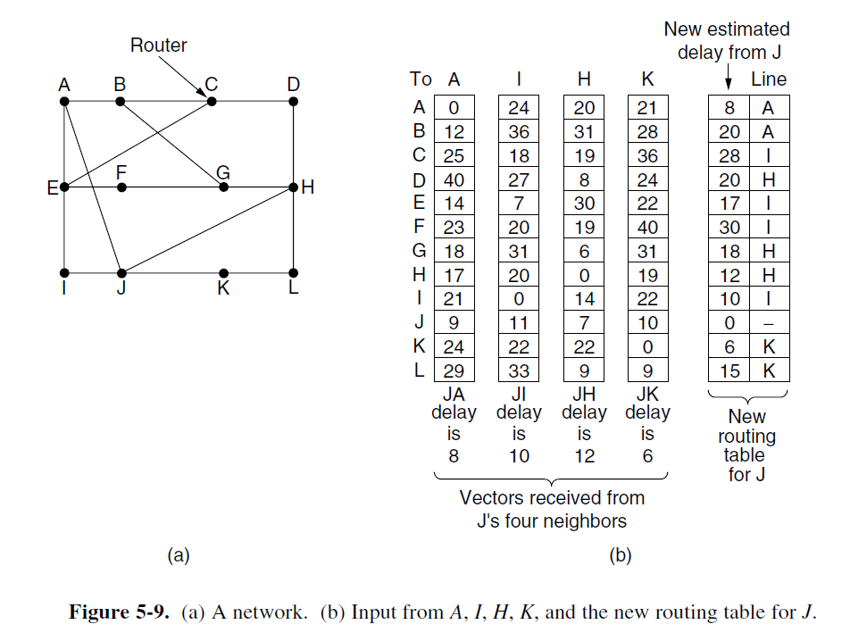

# Distance Vector Routing

-   Each router maintain a table (i.e. a vector) giving the best known distance to each destination and which link to use to get there
-   These tables are updated by exchanging information with the neighbors
-   The router is assumed to know the **distance** to each of its neighbors

