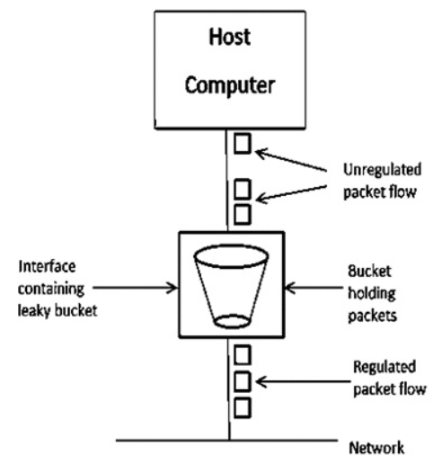
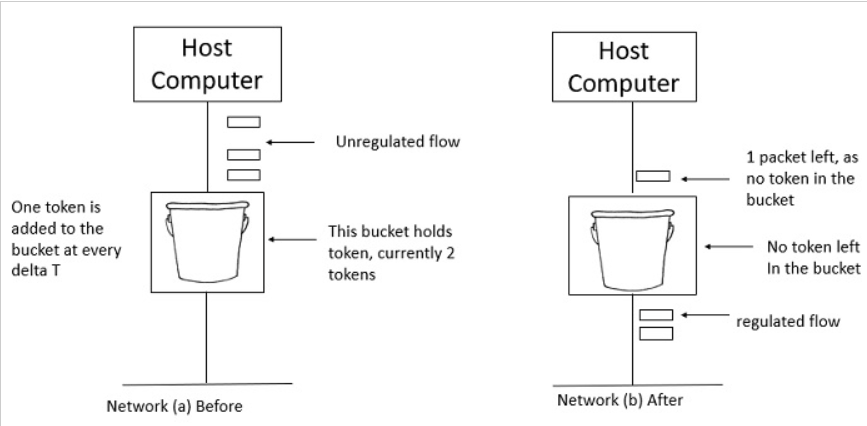

# Traffic Shaping

-   It is a technique for regulating the average rate and burstiness of a flow of data that enters the network
-   When a flow is set up, the user and the network agree on a certain traffic pattern (i.e., **shape**) for that flow
-   This agreement is called an **SLA (Service Level Agreement)**
    -   As long as the customer fulfills her part of the bargain and only sends packets according to the agreed-on contract, the provider promises to deliver them all in a timely fashion
    -   Packets in excess of the agreed pattern might be dropped by the network, or they might be marked as having lower priority.
    -   Monitoring a traffic flow is called **traffic policing**

## Leaky Bucket Algorithm

-   Imagine a bucket with a small hole in the bottom
    -   No matter the rate at which water enters the bucket, the outflow is at a constant rate, `R`, when there is any water in the bucket and `zero` when the bucket is empty
    -   Also, once the bucket is full to capacity `B`, any additional water entering it spills over the sides and is lost
-   Conceptually, each host is connected to the network by an interface containing a leaky bucket
    -   To send a packet into the network, it must be possible to put more water into the bucket
    -   If a packet arrives when the bucket is full, the packet must either be queued until enough water leaks out to hold it or be discarded
        -   The former might happen at a host shaping its traffic for the network as part of the operating system
        -   The latter might happen in hardware at a provider network interface that is policing traffic entering the network

**Implementation**

-   Using a FIFO queue
-   If a new incoming packet can be accepted, then put it into the bucket and decrease the size left of the bucket
-   Constantly remove the packets and hence increase the size left of the bucket
-   If packet size can't be put into the bucket, the packet is lost

## Token Bucket Algorithm

-   A different but equivalent formulation is to imagine the network interface as a bucket that is being filled
    -   The tap is running at rate `R` and the bucket has a capacity of `B`, as before
    -   Now, to send a packet we must be able to take water, or tokens, out of the bucket (rather than putting water into the bucket)
    -   No more than a fixed number of tokens, `B`, can accumulate in the bucket, and if the bucket is empty, we must wait until more tokens arrive before we can send another packet

**Implementation**

-   In regular intervals tokens are thrown into the bucket having some maximum capacity
    -   If the bucket is full, **the tokens are split out**
-   If a packet is ready, then a token is removed from the bucket, and the packet is sent
-   If there is no token in the bucket, the packet can't be sent and we should wait until the next token is arrived
