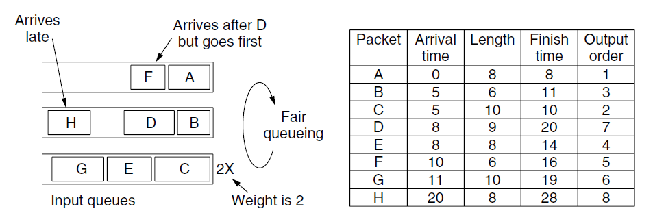

# Packet Scheduling

-   We assume that the packets of a flow follow the same route
-   We must reserve sufficient resources along the route that the packets take through the network
-   Algorithms that allocate router resources among the packets of a flow and between competing flows are called **packet scheduling algorithms**
-   Three different kinds of resources can potentially be reserved for different flows
    -   **Bandwidth**: Reserving bandwidth means not oversubscribing any output line
    -   **Buffer Space**:
        -   When a packet arrives, it is buffered inside the router until it can be transmitted on the chosen outgoing line
        -   The purpose of the buffer is to absorb small bursts of traffic as the flows contend with each other
        -   If no buffer is available, the packet has to be discarded since there is no place to put it
        -   For good quality of service, some buffers might be reserved for a specific flow so that flow does not have to compete for buffers with other flows
    -   **CPU Cycles**
        -   It takes router CPU time to process a packet, so a router can process only a certain number of packets per second
-   **Packet scheduling algorithms** allocate bandwidth and other router resources by determining which of the buffered packets to send on the output line next

## FIFO (First In First Out)

**FCFS (First-Come-First-Serve)**

-   Each router buffers packets in a queue for each output line until they can be sent, and they are sent in the same order that they arrived
-   Usually drop newly arriving packets when the queue is full. This behavior is called **tail drop**
-   It is not suited to providing good quality of service because when there are multiple flows, one flow can easily affect the performance of the other flows as if the first flow is aggressive and sends large bursts of packets, they will lodge in the queue, starving the other flows and reducing their quality of service

## Fair Queueing or Round Robin

-   Routers have separate queues, one for each flow for a given output line
-   When the line becomes idle, the router scans the queues round-robin
-   It then takes the first packet on the next queue
-   In this way, with n hosts competing for the output line, each host gets to send one out of every n packets
-   It is fair in the sense that all flows get to send packets at the same rate
-   Sending more packets will not improve this rate
-   It gives more bandwidth to hosts that use large packets than to hosts that use small packets
-   **Improvement**: Simulate a `byte-by-byte` round-robin, instead of a `packet-by-packet` round-robin
    -   The trick is to compute a virtual time that is the number of the round at which each packet would finish being sent
    -   Each round drains a byte from all of the queues that have data to send
    -   The packets are then sorted in order of their finishing times and sent in that order
    -   **Algorithm**:
        -   If a packet has length `L`, the round at which it will finish is simply `L` rounds after the start time
        -   The start time is either the finish time of the previous packet, or the arrival time of the packet, if the queue is empty when it arrives
-   Fair queueing does not preempt packets that are currently being transmitted
-   Because packets are sent in their entirety, fair queueing is only an approximation of the ideal byte-by-byte scheme

## Weighted Fair Queueing

-   One shortcoming of Fair Queueing algorithm in practice is that it gives all hosts the same priority
-   It gives weights to the flow and let the number of bytes per round be the weight of the flow

$$
F_i = max(A_i,\ F_{i-1}) + \frac{L_i}{W}
$$

`Aᵢ : Arrival time`\
`Lᵢ : Length of iᵗʰ packet`\
`W : Weight of that queue`\
`Fᵢ : Finish Time`\
`Fᵢ₋₁ : Finish Time of the packet in the same queue`

-   With priority scheduling, give higher weight to the queue with higher priority
    -   Ideal priority scheduling gives infinite weight to the high priority queue
