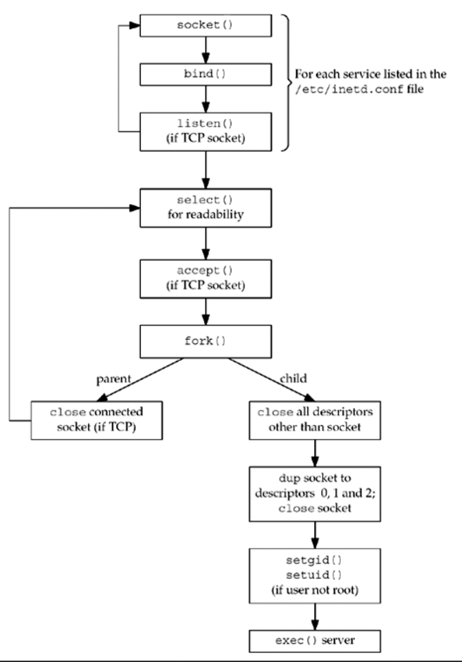

- [Daemon](#daemon)
  - [How to Create a Daemon?](#how-to-create-a-daemon)
    - [What are Daemon Sessions?](#what-are-daemon-sessions)
    - [Creating a Daemon Process](#creating-a-daemon-process)
  - [`inetd` Daemon](#inetd-daemon)
    - [Fields in `inetd.conf` file](#fields-in-inetdconf-file)
    - [Steps Performed by `inetd`](#steps-performed-by-inetd)

# Daemon

-   A daemon is a kind of program that executes in the background unobtrusively, instead of upon the direct access of a user
-   Executed in the background
-   It is an Orphan process
-   Almost every daemon contains names that finish with **d** the letter. For example, `sshd`, this manages connections of SSH remote access, or the `httpd` daemon that manages the Apache server
-   No terminal usage
-   No user interaction is required i.e. rovide services without user's input i.e. almost/completely independent
-   Example Usage: Monitoring the network, checking for periodic logs, running antivirus in all machines without user's input etc.
-   **Linux Processes**:
    -   **Batch**: The batch process is submitted through a processes queue and is not related to the command line
    -   **Interactive**: The interactive process is interactively executed by the user on the command line
    -   **Daemon**: The daemon is identified by a system like those processes whose parent process contains a PID of one
        -   Always, it defines the process `init`. The `init` process is the initial process that is begun when a Linux system is started up and it remains over the system until the system is shut down
        -   The `init` can adopt any type of process whose parent process terminates or dies without waiting for the status of the child process
-   So, the basic technique to launch the daemon is dividing or forking twice or once and also enabling the parent processes to terminate while the child process starts implementing its general function

```sh
# Results having `?` under **TTY** tells daemon's existence
ps -axl

# Shows the processes currently running on our system
# and it show them in a tree diagram
pstree
```

```sh
# Start/Stop/Restart Daemon
service preferred-daemon-name start

service preferred-daemon-name stop

service preferred-daemon-name restart
```

```sh
# List Daemons
service --status-all
```

## How to Create a Daemon?

-   Initial operations, such as reading configuration files or obtaining necessary system resources, must be performed before the process becomes a daemon. This way, the system can report the received errors to the user and the process will be terminated with an appropriate error code
-   A background running process is created with init as its parent process. For this purpose, a sub-process is forked from the init process first, and then the upper process is terminated with `exit`
-   Changing umask (file mode mask) follows
-   A new session should open by calling the `setsid` function, and the process should be disconnected from the terminal
-   Execution switches from the current working directory to a secondary location to preserve file integrity
-   All open Standard file descriptors inherited from the parent process are closed
-   Execution of targeted daemon code

### What are Daemon Sessions?

-   After logging into the system via a terminal, users can run many applications through the shell program
-   These processes should close when the user exits the system
-   The operating system groups these processes into session and process groups
-   Each session consists of process groups
-   The terminal where the processes receive their inputs and send their outputs is called the **controlling terminal**
-   A controlling terminal is associated with only one session at a time
-   A session and the process groups in it have identification (ID) numbers; these identification numbers are the process identification numbers (PID) of the session and process group leaders
-   A child process shares the same group as its parent process
-   When multiple processes are communicating with the pipe mechanism, the first process becomes the **process group leader**

### Creating a Daemon Process

```cpp
#include <dirent.h>
#include <stdlib.h>
#include <sys/stat.h>
#include <syslog.h>
#include <unistd.h>

#include <cstdlib>
#include <cstring>
#include <iostream>
#include <iterator>
#include <sstream>
#include <string>
#include <vector>

#define DAEMON_NAME "named"

void do_heartbeat() {
    // TODO: implement processing code to be performed on each heartbeat
}

// For security purposes, we don't allow any arguments to be passed into the daemon
int main(void) {
    // Process ID and Session ID
    pid_t pid, sid;

    // Fork the current process
    if ((pid = fork()) < 0) {
        // fork() failed
        std::cerr << "Failed to fork()\n";
        exit(EXIT_FAILURE);
    }
    else if (pid > 0) {
        // Parent Process
        exit(EXIT_SUCCESS);
    }

    // The parent process has now terminated, and the forked child process will continue
    // (the pid of the child process was 0)

    // Since the child process is a daemon, the umask needs to be set so files and logs can be written
    // A umask of 0 will make the newly created directories readable, writable, and descendible for everyone
    umask(0);

    // Open system logs for the child process
    openlog(DAEMON_NAME, LOG_CONS | LOG_NDELAY | LOG_PERROR | LOG_PID, LOG_USER);
    syslog(LOG_NOTICE, "Successfully started daemon-name");

    // Generate a session ID for the child process
    sid = setsid();
    // Ensure a valid SID for the child process
    if (sid < 0) {
        // Log failure and exit
        syslog(LOG_ERR, "Could not generate session ID for child process");

        // If a new session ID could not be generated, we must terminate the child process
        // or it will be orphaned
        exit(EXIT_FAILURE);
    }

    // Change the current working directory to a directory guaranteed to exist
    if ((chdir("/")) < 0) {
        // Log failure and exit
        syslog(LOG_ERR, "Could not change working directory to /");

        // If our guaranteed directory does not exist, terminate the child process to ensure
        // the daemon has not been hijacked
        exit(EXIT_FAILURE);
    }

    // A daemon cannot use the terminal, so close standard file descriptors from parent for security reasons
    close(STDIN_FILENO);
    close(STDOUT_FILENO);
    close(STDERR_FILENO);

    // Daemon-specific initialization should go here
    const int SLEEP_INTERVAL = 5;

    // Enter daemon loop
    while (1) {
        // Execute daemon heartbeat, where your recurring activity occurs
        do_heartbeat();

        // Sleep for a period of time
        sleep(SLEEP_INTERVAL);
    }

    // Close system logs for the child process
    syslog(LOG_NOTICE, "Stopping " + DAEMON_NAME);
    closelog();

    // Terminate the child process when the daemon completes
    exit(EXIT_SUCCESS);
}
```

## `inetd` Daemon

-   It stands for **Internet Superserver Daemon**
-   It establishes itself as a daemon
-   It then reads and processes its configuration file, typically **/etc/inetd.conf**
-   This file specifies the services that the superserver is to handle, and what to do when a service request arrives
-   The daemon creates one socket for each service listed in **/etc/inetd.conf**, binding the appropriate port number to each socket

### Fields in `inetd.conf` file


-   The wait-flag field in general, specifies whether the daemon started by `inetd` intends to take over the listening socket associated with the service. UDP services don't have separate listening and accepting sockets, and are virtually always configured as `wait`. TCP services could be handled either way, at the discretion of the person writing the daemon, but `nowait` is most common

### Steps Performed by `inetd`



1.  **On startup, it reads the `/etc/inetd.conf` file and creates a socket of the appropriate type (stream or datagram) for all the services specified in the file. The maximum number of servers that `inetd` can handle depends on the maximum number of descriptors that `inetd` can create. Each new socket is added to a descriptor set that will be used in a call to `select`**
2.  `bind` is called for the socket, specifying the port for the server and the wildcard IP address. This TCP or UDP port number is obtained by calling `getservbyname` with the service-name and protocol fields from the configuration file as arguments.
3.  For TCP sockets, `listen` is called so that incoming connection requests are accepted. This step is not done for datagram sockets.
4.  After all the sockets are created, `select` is called to wait for any of the sockets to become readable. A listening TCP socket becomes readable when a new connection is ready to be accepted and a UDP socket becomes readable when a datagram arrives. `inetd` spends most of its time blocked in this call to `select`, waiting for a socket to be readable.
5.  When `select` returns that a socket is readable, if the socket is a TCP socket and the `nowait` flag is given, `accept` is called to accept the new connection
6.  The `inetd` daemon forks and the child process handles the service request.
    -   The child closes all descriptors except the socket descriptor it is handling: the new connected socket returned by `accept` for a TCP server or the original UDP socket
    -   The child calls `dup2` three times, duplicating the socket onto descriptors 0, 1, and 2 (standard input, standard output, and standard error)
    -   The original socket descriptor is then closed
    -   By doing this, the only descriptors that are open in the child are 0, 1, and 2. If the child reads from standard input, it is reading from the socket and anything it writes to standard output or standard error is written to the socket
    -   The child calls `getpwnam` to get the password file entry for the login-name specified in the configuration file
    -   If this field is not root, then the child becomes the specified user by executing the `setgid` and `setuid` function calls
    -   The child process now does an `exec` to execute the appropriate server-program to handle the request, passing the arguments specified in the configuration file
7.  If the socket is a stream socket, the parent process must close the connected socket. The parent calls `select` again, waiting for the next socket to become readable.
8.  Specifying the `wait` flag for a datagram service changes the steps done by the parent process. This flag says that inetd must wait for its child to terminate before selecting on this socket again
    -   **When `fork` returns in the parent, the parent saves the process ID of the child. This allows the parent to know when this specific child process terminates, by looking at the value returned by `waitpid`**
    -   The parent disables the socket from future selects by using the `FD_CLR` macro to turn off the bit in its descriptor set. This means that the child process takes over the socket until it terminates.
    -   When the child terminates, the parent is notified by a `SIGCHLD` signal, and the parent's signal handler obtains the process ID of the terminating child. It reenables `select` for the corresponding socket by turning on the bit in its descriptor set for this socket
    -   The reason is because there is only one socket for a datagram server, unlike a TCP server that has a listening socket and one connected socket per client
