- [Overview](#overview)
  - [IP Address](#ip-address)
  - [Subnets](#subnets)
  - [Port](#port)
  - [MAC address](#mac-address)
  - [DNS](#dns)
  - [Networking Commands](#networking-commands)
    - [arp](#arp)
    - [ifconfig](#ifconfig)
    - [route](#route)
    - [host](#host)
    - [ping](#ping)
    - [tcpdump](#tcpdump)
    - [netstat](#netstat)
    - [traceroute](#traceroute)
    - [nslookup](#nslookup)
    - [dig](#dig)
    - [ssh](#ssh)
    - [scp](#scp)
    - [ftp](#ftp)
    - [lftp](#lftp)
    - [wget](#wget)
    - [nmap](#nmap)
    - [telnet](#telnet)
    - [netcat/nc/ncat](#netcatncncat)
      - [Client/Server Connection](#clientserver-connection)
      - [Ping Specific Port on Website](#ping-specific-port-on-website)
      - [Scanning Ports](#scanning-ports)
      - [Transfer Files](#transfer-files)
      - [Transfer Directories](#transfer-directories)
      - [Create Web Server](#create-web-server)
      - [Simple Chat Server](#simple-chat-server)
      - [Send HTTP Request](#send-http-request)
- [Evolution of HTTP](#evolution-of-http)
  - [HTTP/0.9](#http09)
  - [HTTP/1.0](#http10)
  - [HTTP/1.1](#http11)
  - [HTTP/2](#http2)
- [The Medium Access Control SubLayer](#the-medium-access-control-sublayer)
  - [The Channel Allocation Problem](#the-channel-allocation-problem)
    - [Static Channel Allocation](#static-channel-allocation)
    - [Assumptions for Dynamic Channel Allocation](#assumptions-for-dynamic-channel-allocation)
  - [Multiple Access Protocols](#multiple-access-protocols)
    - [ALOHA](#aloha)
      - [Pure ALOHA](#pure-aloha)
      - [Slotted ALOHA](#slotted-aloha)
    - [Carrier Sense Multiple Access](#carrier-sense-multiple-access)
      - [Persistent and Nonpersistent CSMA](#persistent-and-nonpersistent-csma)
- [Distance Vector Routing](#distance-vector-routing)
- [Traffic Shaping](#traffic-shaping)
  - [Leaky Bucket Algorithm](#leaky-bucket-algorithm)
  - [Token Bucket Algorithm](#token-bucket-algorithm)
- [Packet Scheduling](#packet-scheduling)
  - [FIFO (First In First Out)](#fifo-first-in-first-out)
  - [Fair Queueing or Round Robin](#fair-queueing-or-round-robin)
  - [Weighted Fair Queueing](#weighted-fair-queueing)

# Overview

## IP Address

-   Every host and router on the Internet has an IP address that can be used in the **Source address** and **Destination address** fields of IP packets
-   An IP address does not actually refer to a host. It really refers to a network interface, so if a host is on two networks, it must have two IP addresses.
    -   Most hosts are on one network and thus have one IP address. In contrast, routers have multiple interfaces and thus multiple IP addresses.

## Subnets

-   Network numbers are managed by a nonprofit corporation called **ICANN (Internet Corporation for Assigned Names and Numbers)**, to avoid conflicts. In turn, ICANN has delegated parts of the address space to various regional authorities, which dole out IP addresses to ISPs and other companies. This is the process by which a company is allocated a block of IP addresses.
-   The process to allow the block of addresses to be split into several parts for internal use as multiple networks, while still acting like a single network to the outside world. This is called **subnetting** and the networks (such as Ethernet LANs) that result from dividing up a larger network are called **subnets**.

## Port

-   A **port** is a number assigned to uniquely identify a connection endpoint and to direct data to a specific service.
-   A port is identified for each transport protocol and address combination by a 16-bit unsigned number, known as the **port number**.
-   A port number is always associated with an IP address of a host and the type of transport protocol used for communication.
-   The practice of attempting to connect to a range of ports in sequence on a single host is commonly known as **port scanning**
-   Port numbers allow different applications on the same computer to share network resources simultaneously.

## MAC address

-   A media access control address (MAC address) is a unique identifier assigned to a network interface controller (NIC) for use as a network address in communications within a network segment.
-   As typically represented, MAC addresses are recognizable as six groups of two hexadecimal digits, separated by hyphens, colons, or without a separator.
-   Network nodes with multiple network interfaces, such as routers and multilayer switches, must have a unique MAC address for each NIC in the same network.
    -   However, two NICs connected to two different networks can share the same MAC address.

## DNS

-   High-level, readable names were introduced in order to decouple machine names from machine addresses.
-   Some mechanism is required to convert the names to network addresses.
-   Domain Name System (DNS) was invented for naming these.
-   To map a name onto an IP address, an application program calls a library procedure called the **resolver**, passing it the name as a parameter. The resolver sends a query containing the name to a local DNS server, which looks up the name and returns a response containing the IP address to the resolver, which then returns it to the caller.
-   If the domain being sought falls under the jurisdiction of the name server, such as `top.cs.vu.nl` falling under `cs.vu.nl`, it returns the authoritative resource records. An **authoritative record** is one that comes from the authority that manages the record and is thus always correct.
    -   Every organization with publicly accessible hosts (such as Web servers and mail servers) on the Internet must provide publicly accessible DNS records that map the names of those hosts to IP addresses. An organization’s authoritative DNS server houses these DNS records.

## Networking Commands

### arp

-   The `arp` command displays the **ARP (Address Resolution Protocol)** table in the memory which is created by the kernel
-   The primary use of ARP is to convert an interface's IPv4 address to the device's MAC (Media Access Control) address
-   For this purpose the kernel maintains an ARP table with the map between several IPv4 addresses of the interfaces in the subnet and the corresponding MAC addresses of the devices in the same subnet
-   The ARP table can be found at `/proc/net/arp`

```sh
arp
# Print the current contents of the table

arp -d <ip_addr>
arp -d <hostname>
# Deletes an entry from the ARP table with IP address corresponding
# to the address (Hostname will be resolved to IP address)

arp -s <ip_addr> <hw_addr>
arp -s <hostname> <hw_addr>
# Inserting a new table entry with IP address corresponding
# to address and the MAC address corresponding to hw_addr.
```

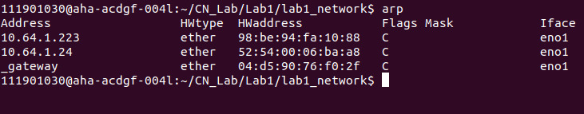

-   **Address** Column corresponds to the IPv4 address of an interface in the subnet
-   **HWtype** refers to the interface type
-   **HWaddress** refers to the MAC address
-   **Iface** refers to the name of the interface.

### ifconfig

-   **Interface Configuration**
-   This command is used to display the status of the running/active interfaces
-   This command is additionally used during the system boot up to initialize interfaces

```sh
ifconfig -a
# Displays all the available interfaces, even if down

ifconfig <interface>
# Displays the status of the interface whose name matches with the
# interface name given in the command.

ifconfig <interface> <up/down>
# Activate/Deactivate the driver for the given interface

ifconfig <interface> <add/del> <ip_addr>
# Used to add/remove an IPv6 address to an interface
```

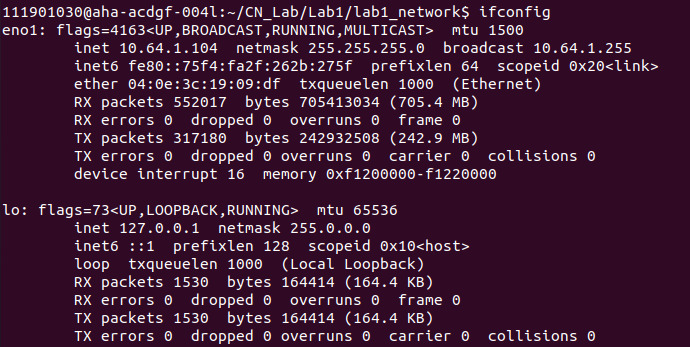

-   The IP address of the interface is described by the `inet` field
-   The MAC address of the interface is described by the `HWaddr` field

### route

-   IP routing table is created by the kernel to map the topology of the network it is in
-   Some automated procedures in the kernel help building the IP routing table
-   The main use of the `route` command is to add static routes into the IP routing table and also to display the IP routing table
-   **Static routes** are the routes that are not discovered by the kernel because they are not part of the network

```sh
route
# Display the routing table entries

sudo route add <name> <gateway> <ip_addr>
# For adding a static route to the IP routing table

sudo route del <name>
# Deleting the static route from the IP routing table
```

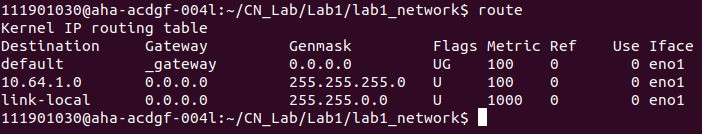

-   The routing table consists of the destination address for each of the interfaces it is connected to hence getting the overall **network topology**

### host

-   The `host` command is used for performing Domain Name System (DNS) lookups. DNS converts a domain name into the IP address of the corresponding interface
-   `host` command is also used for performing reverse DNS lookups i.e converting the IP address of the interface into the domain name of the host it is connected to

```sh
host <hostname>
# Displays IP address associated with the corresponding domain name

host <ip_addr>
# Reverse DNS lookup
# Displays the name of the host corresponding to the IP address.
```

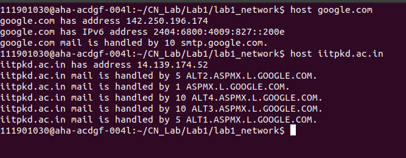

### ping

-   This command is used to test if a device in the network is reachable or not
-   The `ping` command sends a request over the network to the corresponding device and upon successful ping, the corresponding device sends back a response indicating that the ping was successful and the device is reachable in the network

```sh
ping google.com
# Press Ctrl + C to stop pinging

ping -c 5 google.com
# Controlling the number of pings

ping -c 5 -q google.com
# Get only summary

ping -w 3 google.com
# Timeout ping after sometime
```

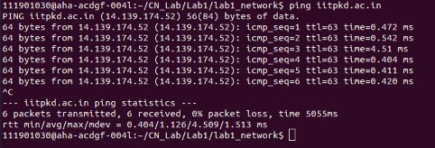

### tcpdump

-   This command prints out the details about the live packets that are passing through the network interface
-   It filters the packets and prints out only a selected few which satisfy a specific boolean condition

```sh
sudo tcpdump
# Capture the packets of current network interface

sudo tcpdump -i <interface>
# Prints out the packets received by the interface

sudo tcpdump -n -i wlo1
# Capture the packets with IP addresses

sudo tcpdump -D
# Checks all the available interfaces for tcpdump
```

-   **Filters**
    -   Host Filters
    -   Network Filters
    -   Protocol and Port Filters
    -   TCP/UDP Port Filters

```sh
# Filter for a specific host
sudo tcpdump host <IP>

# Capture traffic initiated by a source
sudo tcpdump src host <IP>

# Capture traffic initiated for a destination
sudo tcpdump dst host <IP>


```

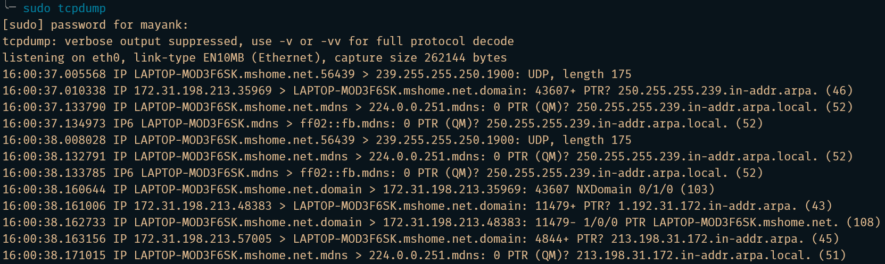

### netstat

-   **Network Statistics**
-   `netstat` is a command that is used to display the network connections, routing tables, and other network statistics
-   This is mainly used for finding the amount of traffic on the network for performance measurements

```sh
netstat -a
# Show both listening and non-listening ports

netstat -l
# Lists all the listening ports

netstat -s
# Display summary statistics for each protocol

netstat -plnt
# Display the ports on which services are running
```

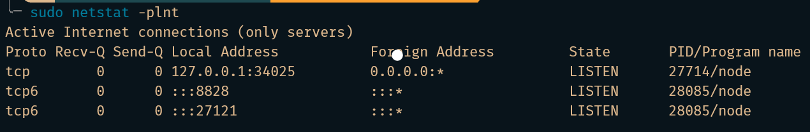

### traceroute

-   Prints the route that a packet takes to reach the host
-   It is useful when we want to know about the route and about all the hops that a packet takes

```sh
traceroute <hostname>

traceroute -g <gateway> <hostname>
# Route the packet through the gateway

traceroute -i <interface> <hostname>
# Route the packet through the interface
```

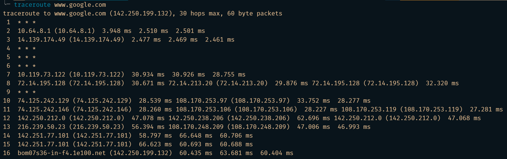

-   The first column corresponds to the hop count
-   The second column represents the address of that hop
-   `traceroute` command sends three packets to the hop, the 3 space-separated time in milliseconds refers to the time taken by each packet to reach the hop

### nslookup

-   **Name Server Lookup**
-   Used to get information from the DNS server
-   Tool for querying the DNS to obtain domain name or IP address mapping or any other specific DNS record
-   Also used to troubleshoot DNS-related problems

```sh
nslookup <hostname>
# Displays IP address associated with the corresponding domain name

nslookup <ip_addr>
# Reverse DNS lookup
# Displays the name of the host corresponding to the IP address.

nslookup -type=any <hostname>
# Look for any record

nslookup -type=soa <hostname>
# Look for an SOA (Start of Authority) record
# Provides the authoritative info of the domain

nslookup -type=ns <hostname>
# Look for an NS (Name Server) record
# NS maps a domain name to a list of DNS servers authoritative for that domain

nslookup -type=a <hostname>
# Look for an A (address) record

nslookup -type=mx <hostname>
# Look for an MX (Mail Exchange) record
# MX record maps a domain name to a list of mail exchange servers for that domain

nslookup -type=txt <hostname>
# TXT records are useful for multiple types of records like DKIM, SPF, etc.
```

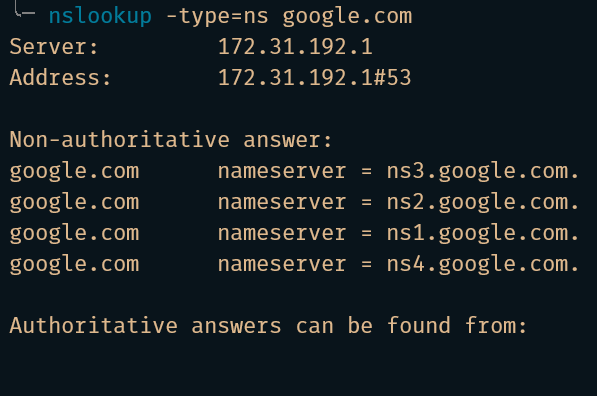

### dig

-   **Domain Information Groper**
-   Used for retrieving information about DNS name servers
-   Used for verifying and troubleshooting DNS problems and to perform DNS lookups
-   It replaces older tools such as `nslookup` and `host`

```sh
dig <hostname>
# DNS Lookup
# Query domain "A" (address) record

dig -x <hostname>
# Reverse DNS Lookup

dig <hostname> +short
# Display only IP address of the domain name

dig <hostname> all
# Query all DNS record types for the domain

dig <hostname> soa
# Query for SOA (Start of Authority) record for the domain

dig <hostname> nx
# Query for NS (Name Server) record for the domain

dig <hostname> mx
# Query for MX (Mail Exchange) record for the domain

dig <hostname> +trace
# Trace DNS lookup path
# Use this command option to identify the IP address where traffic is dropping
```

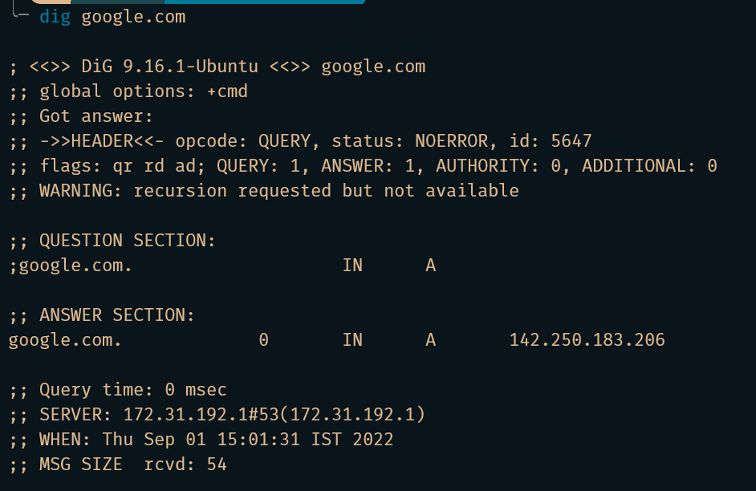

-   **ANSWERS SECTION**
    -   First column is the name of the server queried
    -   Second column is the **Time to Live**, a set timeframe after which the record is refreshed
    -   Third column shows the class of query - in this case `IN` stands for internet
    -   Fourth column displays the type of query - in this case `A` stands for an A (address) record
    -   Last column displays the IP address of the domain name

### ssh

-   **Secure Shell Host**
-   Protocol used to securely connect to a remote server/system
-   Transfers the data in encrypted form between the host and the client
-   Transfers inputs from the client to the host and relays back the output
-   `ssh` runs at TCP/IP port 22

```sh
ssh user_name@host(IP/Domain_name)

ssh user_name@host -p port_number
```

### scp

-   **Secure Copy Protocol**
-   Used to copy file(s) b/w servers in a secure way
-   Allows secure transferring of files in b/w the local host and the remote host or b/w two remote hosts
-   Uses the same authentication and security as it is used in SSH

```sh
scp [-346BCpqrTv] [-c cipher] [-F ssh_config] [-i identity_file] [-P port] source ... target
```

-   The **source** and **target** may be specified as a local pathname, a remote host with optional path in the form `[user@]host:[path]` or a URI in the form `scp://[user@]host[:port][/path]`
-   `-C`: Compression enable. Decrease time if copying a lot of files
-   `-p`: Preserves modification times, access times, and modes from the original file
-   `-q`: Disables the progress meter
-   `-r`: Recursively copy entire directories

### ftp

-   **File Transfer Protocol**
-   Traditional way to transfer files from clients to servers
-   Not only used to transfer data to a remote server, but also to manage that data
-   No encryption involved

```sh
ftp <hostname>

ftp> [command]

ls       # Lists files in server
cd       # change directory in server
cdup     # change to the parent directory
lcd      # change directory on local machine
pwd      # print the current remote working directory
lpwd     # print the current local working directory
mkdir    # creates a new directory within the current remote directory
get      # Downloads file
mget     # Download multiple files
put      # Uploads file
mput     # Uploads multiple files
delete   # remove a file in the current remote directory
rmdir    # remove a directory in the current remote directory
help     # Lists available commands
```

### lftp

-   It is a file transfer program that allows sophisticated FTP, HTTP, and other connections to other hosts
-   Has a built-in mirror that can download or update a whole directory tree
-   There is also a reverse mirror that uploads or updates a directory tree on the server
-   Mirror can also synchronize directories b/w remote servers, using FXP if available

```sh
lftp <hostname>
lftp <hostname>~> user <username>

lftp -u <username> <hostname>
lftp -u <username>,<password> <hostname>

lftp -u <username>,<password> <hostname> -e "set ftp:ssl-allow off"
```

```sh
help

# List all the files in the remote directory
ls

# List all the files in the current local directory
!ls

# Download a remote file to local
get <filename> -o <output_name>

# Upload a file to remote
put <filename> -o <output_name>

# Download the current remote directory to local
mirror <source> <target>

# Download files in parallel
mirror -P

# Upload a directory to remote
mirror -R <source> <target>

# Resume mirror after interruption
mirror -R -c

# Edit a remote file
edit

# Download a torrent file
torrent <Local_Torrent_File/URL/Magnet_link/Hash> -O <target_location>

# Share a file or directory via torrent
# Will provide the magnet URL
torrent --share <file>
```

### wget

-   Non-interactive network downloader
-   Used to download files from the server even when the user has not logged on to the system and can work in the background without hindering the current process

```sh
wget [-bc] [URL]

# Download a webpage
wget [URL]

# Quiet mode and get HTTP response header
wget -q -S [URL]

# Download a file in background
wget -b [URL]

# Resume a partially downloaded file
wget -c [URL]

# Try a given number of times
wget --tries=10 [URL]

# Turn on recursive retrieving
wget -r [URL]

# Reads a document over HTTP and write it to standard output
wget -O- -q <http://localhost/1/download.txt>
```

### nmap

-   **Network Mapper**
-   Tool for network exploration and security auditing
-   Used for:
    -   Real time information of a network
    -   Detailed information of all the IPs activated on your network
    -   Number of ports open in a network
    -   Provide the list of live hosts
    -   Port, OS and Host scanning

```sh
# Scan a system with hostanme and IP address
sudo nmap -v <host/ip_addr>

# Port scan
sudo nmap -p <port> <ip_addr>
sudo nmap -p 8000-9000 <ip_addr>     # Port range
sudo nmap -p 8000,9000 <ip_addr>     # Port list
sudo nmap -p- <ip_addr>              # Scan all ports (1-65535)

# Ping scan: Check if host is up
sudo nmap -sP <ip_addr>

# Scan to detect firewall settings
# Provide if the firewall is active on the host or not
sudo nmap -sA <ip_addr>

# Ask the server for the versions of services it is running
sudo nmap -sV <ip_addr>

# Find hostnames for the given host by completing a DNS query for each one
sudo nmap -sL <ip_addr>

# Scan using TCP protocols
sudo nmap -sT <ip_addr>

# Scan using UDP protocols
sudo nmap -sU <ip_addr>

# Scan the most popular ports
sudo nmap --top-ports <num> <ip_addr>

# `Aggressive`: Let us know the extra information like OS Detection (-O), version detection, script scanning (-sC), and traceroute (-traceroute)
# T4 for faster execution
sudo nmap -A -T4 <domain>

# Discover our Target Hosting service or Identify Additional Targets according to our needs for quickly tracing the path
sudo nmap --trace <domain>

# Never do reverse DNS resolution on the active IP addresses, since it can be slow
sudo nmap -n <domain>

# Always do reverse DNS resolution on the target IP address
sudo nmap -R <domain>

# Scripts
sudo nmap -Pn --script vuln <ip_addr>
sudo nmap -sV --script http-malware-host <ip_addr>
```

### telnet

-   **Teletype Network**
-   Telnet is an old network protocol that is used to connect to remote systems over a TCP/IP network
-   It connects to servers and network equipment

```sh
telnet <host> <port>
```

### netcat/nc/ncat

-   One of the powerful **networking tool, security tool or network monitoring tool**
-   Used for:
    -   Operation related to TCP, UDP or UNIX-domain sockets
    -   Port Scanning
    -   Port listening
    -   Port redirection
    -   Open Remote connections
    -   **Read/Write data across network**
    -   Network debugging
    -   Network daemon testing
    -   Simple TCP proxies
    -   A Socks or HTTP Proxy Command for ssh

```sh
nc <options> <host> <port>
```

-   Has two working modes:
    -   **Connect Mode**: Netcat works as a client and requires the `<host>` and the `<port>` parameters
    -   **Listen Mode**: Netcat works as a server. If `<host>` is omitted, it listens on all available addresses for the specified port
-   Without any options, it tries to start a TCP connection at the provided host and port without any options

| Option                 | Type         | Description                                                                                   |
| ---------------------- | ------------ | --------------------------------------------------------------------------------------------- |
| `-4`                   | Protocol     | Use IPv4 only                                                                                 |
| `-6`                   | Protocol     | Use IPv6 only                                                                                 |
| `-U`                   | Protocol     | Use Unix domain sockets                                                                       |
| `-u`                   | Protocol     | Use UDP connection                                                                            |
| `-g <hop1, hop2, ...>` | Connect Mode | Set hops for loose source routing in IPv4                                                     |
| `-p port`              | Connect Mode | Binds the netcat source port to <port>                                                        |
| `-s host`              | Connect Mode | Binds the netcat source host to <host>                                                        |
| `-l`                   | Listen Mode  | Listen for connections instead of using connect mode                                          |
| `-k`                   | Listen Mode  | Keeps the connection open for multiple simultaneous connections                               |
| `-v`                   | Output       | Verbose                                                                                       |
| `-n`                   | Output       | Don't do any DNS lookups                                                                      |
| `-z`                   | Output       | Report connection status without establishing a connection. Cannot be used together with `-l` |

#### Client/Server Connection

```sh
# Server
nc -lv 1234
```

```sh
# Client
nc -v localhost 1234
```

-   Send a message from either device, and the same message shows up on the other device. **The client and server behave the same after the connection establishes**
-   If from the client we press, **Ctrl + C**, the server will also be stopped

```sh
# Server
nc -lkv 1234
```

-   `-k` to ensure the connection stays open after a disconnects

#### Ping Specific Port on Website

```sh
nc -zv google.com 443
```

#### Scanning Ports

```sh
# Server
nc -lkv 1234
```

```sh
# Scan a port range from another device
nc -zv localhost 1230-1240
```

#### Transfer Files

-   Data transfer possible both ways

```sh
# Listen and send file on connection
nc -lv 1234 < file.txt

# Listen and receive file on connection
nc -lv 1234 > file.txt
```

```sh
# Receive a file on connection
nc -zv localhost 1234 > file.txt

# Send a file on connection
nc -zv localhost 1234 < file.txt
```

#### Transfer Directories

-   Need to pipe it with `tar`

```sh
# Receive directory
nc -lv 1234 | tar xvf -
```

```sh
# Send directory
tar -cf - . | nc -v localhost 1234
```

#### Create Web Server

```sh
# Server
nc -lv localhost 1234
```

```sh
# Run the address on browser or use curl
curl localhost:1234
```

#### Simple Chat Server

```sh
# User 1
mawk -W interactive '$0="Bob: "$0' | nc -lv 1234
```

```sh
# User 2
mawk -W interactive '$0="Alice: "$0' | nc -v localhost 1234
```

-   Then, both can chat after successful connection

#### Send HTTP Request

```sh
printf "GET / HTTP/1.0\r\n\r\n" | nc -v google.com 80
```

# Evolution of HTTP

## HTTP/0.9

**The one-line protocol**

-   Extremely simple
-   Requests consisted of a single line and started with the only possible method `GET` followed by the path to the resource
-   No HTTP headers
-   Only HTML files could be transmitted
-   No status or error codes

```sh
GET /mypage.html
```

## HTTP/1.0

**Building extensibility**

-   Versioning information was sent within each request (`HTTP/1.0` was appended to the `GET` line)
-   New utilities: `Header`, `Versioning`, `Status Code`, `Content-Type`
-   Methods supported: `GET`, `HEAD`, `POST`

## HTTP/1.1

**The standardized protocol**

-   A connection could be reused, which saved time. It is no longer needed to be opened multiple times to display the resources embedded in the single original document
-   Pipelining was added. This allowed a second request to be sent before the answer to the first one was fully transmitted.
-   Chunked responses were also supported
-   Cache control mechanisms were introduced
-   Content negotiation, including language, encoding, and type, was introduced. A client and server could now agree on which content to exchange.
-   `HOST` header: ability to host different domains from the same IP address allowed server collocation
-   Methods supported: `GET`, `HEAD`, `POST`, `PUT`, `DELETE`, `TRACE`, `OPTIONS`

## HTTP/2

**A protocol for greater performance**

-   Binary protocol rather than a text protocol. Can't be read and created manually.
-   Multiplexed protocol. Parallel requests can be made over the same connection
-   Compresses headers
-   Allows a server to populate data in a client cache through **server push**

# The Medium Access Control SubLayer

-   In any broadcast network, the key issue is how to determine who gets to use the channel when there is competition for it
-   Broadcast channels are sometimes referred to as **Multi-access channels** or **random access channels**
-   The protocols used to determine who goes next on a multi-access channel belong to a sublayer of the data link layer called the **MAC (Medium Access Control)** sublayer

## The Channel Allocation Problem

### Static Channel Allocation

-   Traditional way is to chop up the the capacity by using one of the multiplexing schemes, such as FDM
-   A wireless example is FM radio stations
-   **Disadvantages**
    -   If the band is divided into N regions, there could be less or more than N users
-   Poor performance of static FDM: using simple queueing theory calculation

```sh
T : Mean Time Delay to send a frame onto a channel
C : capacity of the channel (bps)
λ : Arrival rate of frames (frames/sec)
Average length of frames : 1/μ bits

Service rate of the channel is μC frames/sec

T =  1 / (μC - λ)
```

```sh
Divide single channels into N independent subchannels,
each with capacity C/N bps

Mean input rate on each subchannel = λ/N

Tₙ = 1 / μ(C/N) - (λ/N)
  = N / (μC - λ) = NT
```

-   The mean delay of the divided channels is N times worse than if all the frames were somehow magically arranged orderly in a big central queue

### Assumptions for Dynamic Channel Allocation

-   **Independent Traffic**:
    -   The model consists of `N` independent **stations** each with a program/user that generates frames for transmission
    -   Expected no. of frames generated in an interval of length `Δt` is `λΔt`, where `λ` is constant (arrival rate of new frames)
    -   Once a frame is generated, the station is blocked, and does nothing until the frame has been successfully transmitted
-   **Single Channel**:
    -   A single channel is available for all communication
    -   All stations can transmit on it and all can receive from it
    -   The stations are assumed to be equally capable
-   **Observable Collisions**:
    -   If two frames are transmitted simultaneously, they overlap in time and the resulting signal is garbled. This event is called a **collision**
    -   All stations can detect that a collision has occurred
    -   A collided frame must be transmitted again later
    -   No errors other than those generated by collisions occur
-   **Continuous or Slotted Time**:
    -   Time may be assumed continuous, in which case the frame transmission can begin at any instant
    -   Alternatively, time may be slotted or divided into discrete intervals (called slots). Frame transmissions must then begin at the start of a slot. A slot may contain 0, 1, or more frames, corresponding to an idle slot, a successful transmission, or a collision, respectively.
-   **Carrier Sense or No Carrier Sense**:
    -   Stations can tell if the channel is in use before trying to use it
    -   No station will attempt to use the channel while it is sensed as busy
    -   If there is no carrier sense, stations cannot sense the channel before trying to use it. They just go ahead and transmit. Only later can they determine whether the transmission was successful.

## Multiple Access Protocols

### ALOHA

#### Pure ALOHA

-   Continuous time
-   Let users transmit whenever they have data to send
-   Colliding frames will be damaged
-   In the ALOHA system, after each station has sent its frame to the central computer, this computer rebroadcasts the frame to all of the stations. A sending station can thus listen for the broadcast from the hub to see if its frame has gotten through.
-   If the frame was destroyed, the sender just waits a random amount of time and sends it again.
-   Systems in which multiple users share a common channel in a way that can lead to conflicts are known as **contention** systems
-   **Frame time**: amount of time needed to transmit the standard, fixed-length frame (i.e. the frame length divided by the bit rate)
    -   **Vulnerable Time** `= 2 * Frame Time`
-   Assume new frames generated by the stations are well modeled by a Poisson distribution with a mean of `N` frames per frame time
    -   If `N > 1`, the user community is generating frames at a higher rate than the channel can handle, and nearly every frame will suffer a collision
    -   For reasonable throughput, we would expect `0 < N < 1`
-   In addition to the new frames, the stations also generate retransmissions of frames that previously suffered collisions. Let us further assume that the old and new frames combined are well modeled by a Poisson distribution, with mean of `G` frames per frame time
    -   At low load (i.e., `N ≈ 0`), there will be few collisions, hence few retransmissions, so `G ≈ N`
    -   At high load, there will be many collisions, so `G > N`
-   Throughput `S = GP₀`, where P0 is the probability that a frame does not suffer a collision
-   The probability that `k` frames are generated during a given frame time, in which `G` frames are expected, is given by the Poisson distribution
    ```sh
    Pr[k] = Gᵏe⁻ᴳ / k!
    ```
    -   Probability of zero frames is `e⁻ᴳ`
    -   Mean frames generated is `2G`
    -   Probability that no frame is generated during the entire vulnerable period is `e⁻²ᴳ`
    -   `S = Ge⁻²ᴳ`

#### Slotted ALOHA

-   Doubles the capacity of the ALOHA system
-   Divide the time into discrete intervals called **slots**, each interval corresponding to one frame
-   A station is not permitted to send whenever the user types a line. Instead, it is required to wait for the beginning of the next slot.
    -   This halves the vulnerable period
    -   Probability that no frame is generated during the entire vulnerable period is `e⁻ᴳ`
    -   `S = Ge⁻ᴳ`
    -   Probability of a collision is `1 - e⁻ᴳ`
    -   Probability of a transmission requiring exactly k attempts is `Pₖ = e⁻ᴳ(1 - e⁻ᴳ)ᵏ⁻¹`
    -   Expected number of transmissions, `E`, per line typed at a terminal is
        ```sh
        E = Σ k . Pₖ
          = eᴳ
        ```

### Carrier Sense Multiple Access

-   Protocols in which stations listen for a carrier (i.e., a transmission) and act accordingly are called **carrier sense protocols**

#### Persistent and Nonpersistent CSMA

-   Station waits until the channel is idle to send its data
-   **1-persistent CSMA**: Station transmits with a probability of 1 when it finds the channel idle
-   **Non-persistent CSMA**: Upon finding an idle channel, wait for a random amount of time and then repeat the algorithm
-   **p-persistent CSMA**: Station transmits with a probability of `p` when it finds the channel idle

# Distance Vector Routing

-   Each router maintain a table (i.e. a vector) giving the best known distance to each destination and which link to use to get there
-   These tables are updated by exchanging information with the neighbors
-   The router is assumed to know the **distance** to each of its neighbors

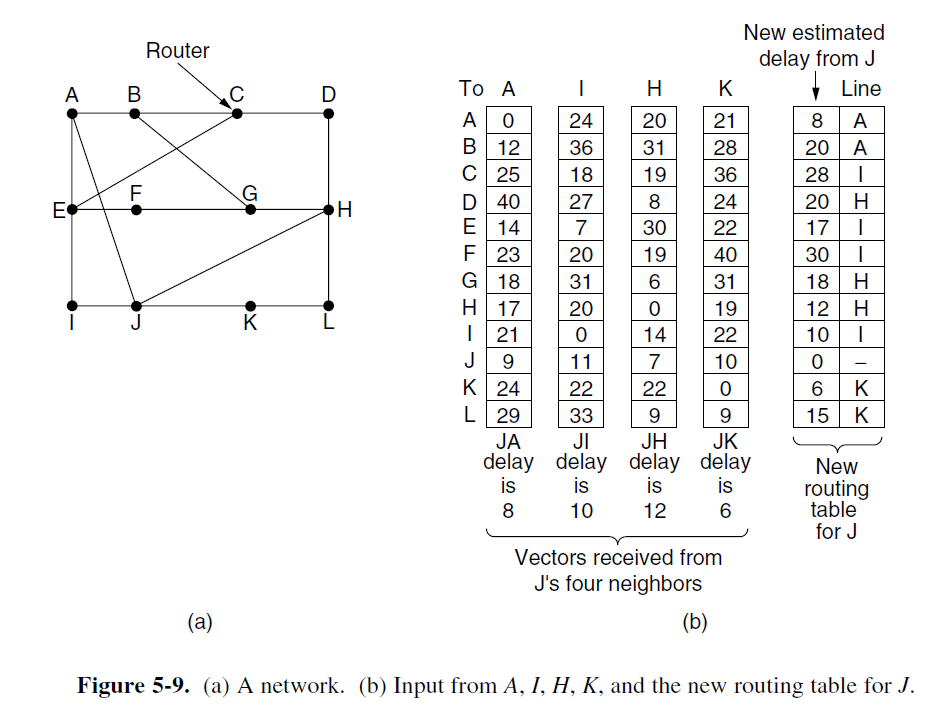

# Traffic Shaping

-   It is a technique for regulating the average rate and burstiness of a flow of data that enters the network
-   When a flow is set up, the user and the network agree on a certain traffic pattern (i.e., **shape**) for that flow
-   This agreement is called an **SLA (Service Level Agreement)**
    -   As long as the customer fulfills her part of the bargain and only sends packets according to the agreed-on contract, the provider promises to deliver them all in a timely fashion
    -   Packets in excess of the agreed pattern might be dropped by the network, or they might be marked as having lower priority.
    -   Monitoring a traffic flow is called **traffic policing**

## Leaky Bucket Algorithm

-   Imagine a bucket with a small hole in the bottom
    -   No matter the rate at which water enters the bucket, the outflow is at a constant rate, `R`, when there is any water in the bucket and `zero` when the bucket is empty
    -   Also, once the bucket is full to capacity `B`, any additional water entering it spills over the sides and is lost
-   Conceptually, each host is connected to the network by an interface containing a leaky bucket
    -   To send a packet into the network, it must be possible to put more water into the bucket
    -   If a packet arrives when the bucket is full, the packet must either be queued until enough water leaks out to hold it or be discarded
        -   The former might happen at a host shaping its traffic for the network as part of the operating system
        -   The latter might happen in hardware at a provider network interface that is policing traffic entering the network

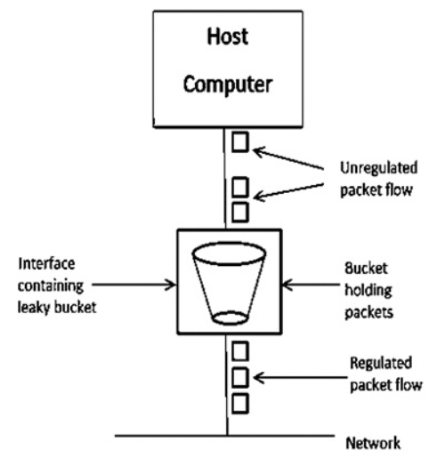

**Implementation**

-   Using a FIFO queue
-   If a new incoming packet can be accepted, then put it into the bucket and decrease the size left of the bucket
-   Constantly remove the packets and hence increase the size left of the bucket
-   If packet size can't be put into the bucket, the packet is lost

## Token Bucket Algorithm

-   A different but equivalent formulation is to imagine the network interface as a bucket that is being filled
    -   The tap is running at rate `R` and the bucket has a capacity of `B`, as before
    -   Now, to send a packet we must be able to take water, or tokens, out of the bucket (rather than putting water into the bucket)
    -   No more than a fixed number of tokens, `B`, can accumulate in the bucket, and if the bucket is empty, we must wait until more tokens arrive before we can send another packet

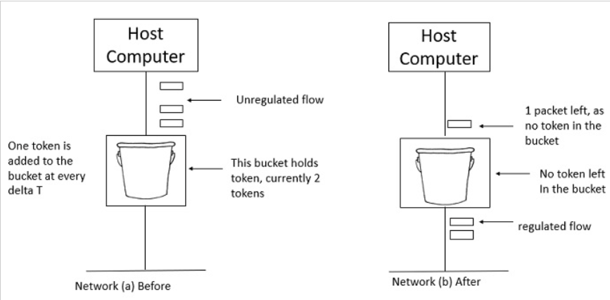

**Implementation**

-   In regular intervals tokens are thrown into the bucket having some maximum capacity
    -   If the bucket is full, **the tokens are split out**
-   If a packet is ready, then a token is removed from the bucket, and the packet is sent
-   If there is no token in the bucket, the packet can't be sent and we should wait until the next token is arrived

# Packet Scheduling

-   We assume that the packets of a flow follow the same route
-   We must reserve sufficient resources along the route that the packets take through the network
-   Algorithms that allocate router resources among the packets of a flow and between competing flows are called **packet scheduling algorithms**
-   Three different kinds of resources can potentially be reserved for different flows
    -   **Bandwidth**: Reserving bandwidth means not oversubscribing any output line
    -   **Buffer Space**:
        -   When a packet arrives, it is buffered inside the router until it can be transmitted on the chosen outgoing line
        -   The purpose of the buffer is to absorb small bursts of traffic as the flows contend with each other
        -   If no buffer is available, the packet has to be discarded since there is no place to put it
        -   For good quality of service, some buffers might be reserved for a specific flow so that flow does not have to compete for buffers with other flows
    -   **CPU Cycles**
        -   It takes router CPU time to process a packet, so a router can process only a certain number of packets per second
-   **Packet scheduling algorithms** allocate bandwidth and other router resources by determining which of the buffered packets to send on the output line next

## FIFO (First In First Out)

**FCFS (First-Come-First-Serve)**

-   Each router buffers packets in a queue for each output line until they can be sent, and they are sent in the same order that they arrived
-   Usually drop newly arriving packets when the queue is full. This behavior is called **tail drop**
-   It is not suited to providing good quality of service because when there are multiple flows, one flow can easily affect the performance of the other flows as if the first flow is aggressive and sends large bursts of packets, they will lodge in the queue, starving the other flows and reducing their quality of service

## Fair Queueing or Round Robin

-   Routers have separate queues, one for each flow for a given output line
-   When the line becomes idle, the router scans the queues round-robin
-   It then takes the first packet on the next queue
-   In this way, with n hosts competing for the output line, each host gets to send one out of every n packets
-   It is fair in the sense that all flows get to send packets at the same rate
-   Sending more packets will not improve this rate
-   It gives more bandwidth to hosts that use large packets than to hosts that use small packets
-   **Improvement**: Simulate a `byte-by-byte` round-robin, instead of a `packet-by-packet` round-robin
    -   The trick is to compute a virtual time that is the number of the round at which each packet would finish being sent
    -   Each round drains a byte from all of the queues that have data to send
    -   The packets are then sorted in order of their finishing times and sent in that order
    -   **Algorithm**:
        -   If a packet has length `L`, the round at which it will finish is simply `L` rounds after the start time
        -   The start time is either the finish time of the previous packet, or the arrival time of the packet, if the queue is empty when it arrives
-   Fair queueing does not preempt packets that are currently being transmitted
-   Because packets are sent in their entirety, fair queueing is only an approximation of the ideal byte-by-byte scheme

## Weighted Fair Queueing

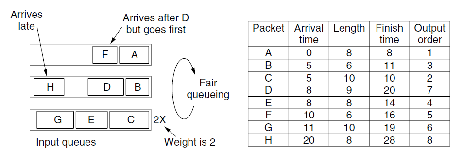

-   One shortcoming of Fair Queueing algorithm in practice is that it gives all hosts the same priority
-   It gives weights to the flow and let the number of bytes per round be the weight of the flow

$$
F_i = max(A_i,\ F_{i-1}) + \frac{L_i}{W}
$$

`Aᵢ : Arrival time`\
`Lᵢ : Length of iᵗʰ packet`\
`W : Weight of that queue`\
`Fᵢ : Finish Time`\
`Fᵢ₋₁ : Finish Time of the packet in the same queue`

-   With priority scheduling, give higher weight to the queue with higher priority
    -   Ideal priority scheduling gives infinite weight to the high priority queue
