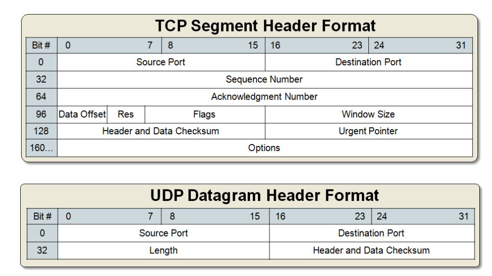

- [Socket Programming](#socket-programming)
  - [What is a Socket?](#what-is-a-socket)
  - [Key concepts](#key-concepts)
    - [TCP vs UDP](#tcp-vs-udp)
    - [Network Byte Order](#network-byte-order)
  - [Library Utils](#library-utils)
    - [`structs`](#structs)
      - [`addrinfo`](#addrinfo)
      - [`sockaddr`](#sockaddr)
      - [`sockaddr_in`](#sockaddr_in)
      - [`in_addr`](#in_addr)
      - [`sockaddr_in6` and `in6_addr`](#sockaddr_in6-and-in6_addr)
      - [`sockaddr_storage`](#sockaddr_storage)
    - [IP Address Conversion](#ip-address-conversion)
      - [`inet_pton()`](#inet_pton)
      - [`inet_ntop()`](#inet_ntop)
    - [System Calls](#system-calls)
      - [`getaddrinfo()`: Prepare to Launch](#getaddrinfo-prepare-to-launch)
      - [`getnameinfo()`: Ready for Launch?](#getnameinfo-ready-for-launch)
      - [`getpeername()`: Who are you?](#getpeername-who-are-you)
      - [`gethostname()`: Who am I?](#gethostname-who-am-i)
      - [`socket()`: Get the File Descriptor](#socket-get-the-file-descriptor)
      - [`bind()`: What port am I on?](#bind-what-port-am-i-on)
      - [`connect()`: Hey you!](#connect-hey-you)
      - [`listen()`: Will somebody please call me?](#listen-will-somebody-please-call-me)
      - [`accept()`: Thank you for calling me!](#accept-thank-you-for-calling-me)
      - [`send()` and `recv()`: Talk to me Stream Sockets](#send-and-recv-talk-to-me-stream-sockets)
      - [`sendto()` and `recvfrom()`: Talk to me Datagram Sockets](#sendto-and-recvfrom-talk-to-me-datagram-sockets)
      - [`close()` and `shutdown()`: Get outta my face!](#close-and-shutdown-get-outta-my-face)
      - [`perror()` and `strerror()`: Oh No!](#perror-and-strerror-oh-no)
    - [Jumping from IPv4 to IPv6](#jumping-from-ipv4-to-ipv6)
  - [Client-Server Communication](#client-server-communication)
    - [Procedure](#procedure)
    - [Steps on the `server` side](#steps-on-the-server-side)
    - [Steps on the `client` side](#steps-on-the-client-side)

# Socket Programming

https://beej.us/guide/bgnet/html/#intro

-   Socket programming is a way of connecting two nodes on a network to communicate with each other
-   One socket(node) listens on a particular port at an IP (called the **server**), while the other socket reaches out to the other to form a connection (called the **client**)

## What is a Socket?

-   The socket we see in reality is a medium to connect two devices or systems
-   **They let applications attach to the local network at different ports**
-   Sockets are a mechanism for exchanging data between processes
    -   These processes can either be on the same machine, or on different machines connected via a network
-   Once a socket connection is established, data can be sent in both directions until one of the endpoints closes the connection

## Key concepts

-   Socket is a way of speaking to other programs using standard **file descriptors**
-   **Where do we get the file descriptor for network communication?**\
    Well, we make a call to the `socket()` system routine\
    After the `socket()` returns the socket descriptor, we start communicate through it using the specialized `send()/recv()` socket API calls
-   A TCP socket is an **endpoint instance**
-   A TCP socket is **not a connection**, it is the **endpoint** of a specific connection
-   A TCP connection is defined by **two endpoints** aka sockets
-   The purpose of **ports** is to **differentiate multiple endpoints** on a given network address
-   The port numbers are encoded in the transport protocol packet header, and they can be readily interpreted not only by the sending and receiving computers, but also by other components of the networking infrastructure
    -   In particular, firewalls are commonly configured to differentiate between packets based on their source or destination **port numbers** as in **port forwarding**
-   It is the **socket pair** (the **4-tuple** consisting of the client IP address, client port number, server IP address, and server port number) that specifies the two endpoints that uniquely identifies each **TCP connection** in an internet
-   Only **one process** may bind to a specific **IP address** and **port** combination using the **same transport protocol**
    -   Otherwise, we'll have **port conflicts**, where multiple programs attempt to bind to the same port numbers on the same IP address using the same protocol

To connect to another machine, we need a **socket connection**

What's a connection?

-   A **relationship** between two machines, where **two pieces of software know about each other**
-   They know how to communicate with each other i.e. how to send **bits** to each other
-   A socket connection means the two machines have information about each other, including **network location (IP address)** and **TCP port**
    -   IP address is the **phone number** and the TCP port is the **extension**
-   A socket is an object similar to a file that allows a program to accept incoming connections, make outgoing connections, and send and receive data
-   **Before two machines can communicate, both must create a socket object**
-   A socket is a **resource** assigned to the server process. The server creates it using the system call `socket()`, and it can't be shared with other processes

### TCP vs UDP

-   There are **stream** sockets and the **datagram** sockets that determine the structure of the transport layer




-   **Stream Sockets**:
    -   Stream sockets provide **reliable two-way** communication similar to when we call someone on the phone
    -   One side initiates the connection to the other, and after the connection is established, either side can communicate to the other
    -   There is immediate confirmation that what we said actually reached its destination
    -   Stream sockets use a **Transmission Control Protocol (TCP)**, which exists on the transport layer of the Open Systems Interconnection (OSI) model
    -   The data is usually transmitted in packets
    -   TCP is designed so that the packets of data will arrive without errors and in sequence
    -   Webservers, mail servers, and their respective client applications all use TCP and stream socket to communicate
-   **Datagram Sockets**:
    -   Communicating with a datagram socket is more like mailing a letter than making a phone call i.e. the connection is **one-way** only and **unreliable**
    -   We can't be sure that packets arrive in the same order, or even that they reached their destination at all
    -   Datagram sockets use **User Datagram Protocol (UDP)**
    -   It's not a real connection, just a basic method for sending data from one point to another
    -   Datagram sockets and UDP are commonly used in networked games and streaming media
    -   Services provided by UDP are typically used where a client needs to make a short query of a server and expects a single short response
    -   To access a service from UDP, we need to use the UDP specific system calls, `sendto()` and `recvfrom()` instead of `read()` and `write()` on the socket
    -   UDP is used by app that doesn't want reliability or bytestreams
        -   Voice-over-ip (unreliable) such as conference call
        -   DNS, RPC (message-oriented)
        -   DHCP (bootstrapping)

### Network Byte Order

-   The port number and IP address used in the **AF_INET** socket address structure are expected to follow the network byte ordering (big-endian)
-   Hence, we want to **convert the numbers to Network Byte Order** before they go out on the wire, and **convert them to Host Byte Order** as they come in off the wire
-   There are specialized functions for the conversions, and they are defined in `netinet.h` and `arpa/inet.h`

```cpp
htonl(long value)  // Host-to-Network Long
// Converts a 32-bit integer from the host's byte order to network byte order.

htons(short value) // Host-to-Network Short
// Converts a 16-bit integer from the host's byte order to network byte order.

ntohl(long value)  // Network-to-Host Long
// Converts a 32-bit integer from network byte order to the host's byte order.

ntohs(short value) // Network-to-Host Short
// Converts a 16-bit integer from network byte order to the host's byte order
```

## Library Utils

**Sockets**, in C, behaves like files because they use file descriptors to identify themselves. Sockets behave so much like files that we can use the `read()` and `write()` to receive and send data using **socket file descriptors**

File: **/usr/include/sys/sockets.h**

### `structs`

#### `addrinfo`

```cpp
struct addrinfo {
    int              ai_flags;     // AI_PASSIVE, AI_CANONNAME, etc.
    int              ai_family;    // AF_INET, AF_INET6, AF_UNSPEC
    int              ai_socktype;  // SOCK_STREAM, SOCK_DGRAM
    int              ai_protocol;  // use 0 for "any"
    size_t           ai_addrlen;   // size of ai_addr in bytes
    struct sockaddr *ai_addr;      // struct sockaddr_in or _in6
    char            *ai_canonname; // full canonical hostname

    struct addrinfo *ai_next;      // linked list, next node
};
```

#### `sockaddr`

```cpp
struct sockaddr {
    unsigned short    sa_family;    // address family, AF_xxx
    char              sa_data[14];  // 14 bytes of protocol address
};
```

#### `sockaddr_in`

```cpp
// (IPv4 only--see struct sockaddr_in6 for IPv6)
struct sockaddr_in {
    short int          sin_family;  // Address family, AF_INET
    unsigned short int sin_port;    // Port number
    struct in_addr     sin_addr;    // Internet address
    unsigned char      sin_zero[8]; // Same size as struct sockaddr
};
```

-   **sin_family** = specifies the address family\
    **sin_addr** = Holds the IP address to be used in the socket connection\
    **sin_port** = specifies the port number and must be used with `htons()` function that converts the **host byte order** to **network byte order** so that it can be transmitted and routed properly when opening the socket connection

#### `in_addr`

```cpp
// (IPv4 only--see struct in6_addr for IPv6)

// Internet address (a structure for historical reasons)
struct in_addr {
    uint32_t s_addr; // that's a 32-bit int (4 bytes)
};
```

#### `sockaddr_in6` and `in6_addr`

```cpp
// (IPv6 only--see struct sockaddr_in and struct in_addr for IPv4)

struct sockaddr_in6 {
    u_int16_t       sin6_family;   // address family, AF_INET6
    u_int16_t       sin6_port;     // port number, Network Byte Order
    u_int32_t       sin6_flowinfo; // IPv6 flow information
    struct in6_addr sin6_addr;     // IPv6 address
    u_int32_t       sin6_scope_id; // Scope ID
};

struct in6_addr {
    unsigned char   s6_addr[16];   // IPv6 address
};
```

#### `sockaddr_storage`

```cpp
struct sockaddr_storage {
    sa_family_t  ss_family;     // address family

    // all this is padding, implementation specific, ignore it:
    char      __ss_pad1[_SS_PAD1SIZE];
    int64_t   __ss_align;
    char      __ss_pad2[_SS_PAD2SIZE];
};
```

### IP Address Conversion

**arpa/inet.h**

#### `inet_pton()`

-   `inet_pton()` converts an IP address in numbers-and-dot notation into either a `struct in_addr` or a `struct in6_addr`
-   It returns `-1` on error
-   Printable form to Network form

```cpp
struct sockaddr_in sa; // IPv4
struct sockaddr_in6 sa6; // IPv6

inet_pton(AF_INET, "10.12.110.57", &(sa.sin_addr)); // IPv4
inet_pton(AF_INET6, "2001:db8:63b3:1::3490", &(sa6.sin6_addr)); // IPv6
```

#### `inet_ntop()`

-   `inet_ntop()` converts an `in_addr` or `in6_addr` into printable form

```cpp
// IPv4:

char ip4[INET_ADDRSTRLEN];  // space to hold the IPv4 string
struct sockaddr_in sa;      // pretend this is loaded with something

inet_ntop(AF_INET, &(sa.sin_addr), ip4, INET_ADDRSTRLEN);

printf("The IPv4 address is: %s\n", ip4);
```

```cpp
// IPv6:

char ip6[INET6_ADDRSTRLEN]; // space to hold the IPv6 string
struct sockaddr_in6 sa6;    // pretend this is loaded with something

inet_ntop(AF_INET6, &(sa6.sin6_addr), ip6, INET6_ADDRSTRLEN);

printf("The address is: %s\n", ip6);
```

### System Calls

#### `getaddrinfo()`: Prepare to Launch

```cpp
#include <sys/types.h>
#include <sys/socket.h>
#include <netdb.h>

int getaddrinfo(const char *node,     // e.g. "www.example.com" or IP
                const char *service,  // e.g. "http" or port number
                const struct addrinfo *hints,
                struct addrinfo **res);
```

-   Does DNS and service name lookups
-   Gives pointer to a **linked-list**, `res`, of results
-   [Example](showip.cpp)

```cpp
// Example
int status;
struct addrinfo hints;
struct addrinfo *servinfo;  // will point to the results

memset(&hints, 0, sizeof hints); // make sure the struct is empty
hints.ai_family = AF_UNSPEC;     // don't care IPv4 or IPv6
hints.ai_socktype = SOCK_STREAM; // TCP stream sockets
hints.ai_flags = AI_PASSIVE;     // fill in my IP for me

if ((status = getaddrinfo("www.example.net", "3490", &hints, &servinfo)) != 0) {
    fprintf(stderr, "getaddrinfo error: %s\n", gai_strerror(status));
    exit(1);
}

// servinfo now points to a linked list of 1 or more struct addrinfos

// ... do everything until you don't need servinfo anymore ....

freeaddrinfo(servinfo); // free the linked-list
```

#### `getnameinfo()`: Ready for Launch?

```cpp
#include <sys/socket.h>
#include <netdb.h>

int getnameinfo(const struct sockaddr *sa, socklen_t salen,
                char *host, size_t hostlen,
                char *serv, size_t servlen, int flags);
```

-   Look up the host name and service name information for a given struct sockaddr
-   Opposite for `getaddrinfo()`, i.e. it takes already loaded `struct sockaddr` and does a name and service name lookup on it
-   Result will be in `host` and `serv` parameters

```cpp
// Example
struct sockaddr_in6 sa; // could be IPv4 if you want
char host[1024];
char service[20];

// pretend sa is full of good information about the host and port...

getnameinfo(&sa, sizeof sa, host, sizeof host, service, sizeof service, 0);

printf("   host: %s\n", host);    // e.g. "www.example.com"
printf("service: %s\n", service); // e.g. "http"
```

#### `getpeername()`: Who are you?

```cpp
#include <sys/socket.h>

int getpeername(int sockfd, struct sockaddr *addr, socklen_t *addrlen)
```

-   Tell who is at the other end of the connected stream socket
-   Returns `-1` on error

#### `gethostname()`: Who am I?

```cpp
#include <unistd.h>

int gethostname(char *hostname, size_t size);
```

-   It returns the name of the computer that our program is running on
-   The name can then be used by `getaddrinfo()` to determine the IP address of our local machine
-   `hostname` is a pointer to an array of chars that will contain the hostname upon the function's return

#### `socket()`: Get the File Descriptor

```cpp
#include <sys/types.h>
#include <sys/socket.h>

int socket(int domain, int type, int protocol);
```

-   Used to create a new socket
-   Returns a file descriptor for the socket or `-1` on error
-   **Parameters**:
    -   **Domain**:
        -   Protocol family of socket being requested
        -   Should be `AF_INET` or `AF_INET6`
    -   **Type**:
        -   Type of socket within that family
        -   Either `SOCK_STREAM` for TCP/IP or `SOCK_DGRAM` for UDP/IP
    -   **Protocol**:
        -   Usually set to `0` to indicate that the default protocol should be used
-   The address families, protocol families and type of sockets are defined in **bits/socket.h**, which is automatically included from **sys/socket.h**

```cpp
/* Address families.  */
#define AF_UNSPEC       PF_UNSPEC
#define AF_LOCAL        PF_LOCAL
#define AF_UNIX         PF_UNIX
#define AF_FILE         PF_FILE
#define AF_INET         PF_INET
#define AF_AX25         PF_AX25
#define AF_IPX          PF_IPX
#define AF_APPLETALK    PF_APPLETALK
#define AF_NETROM       PF_NETROM
#define AF_BRIDGE       PF_BRIDGE
#define AF_ATMPVC       PF_ATMPVC
#define AF_X25          PF_X25
#define AF_INET6        PF_INET6
#define AF_ROSE         PF_ROSE
#define AF_DECnet       PF_DECnet
#define AF_NETBEUI      PF_NETBEUI
#define AF_SECURITY     PF_SECURITY
#define AF_KEY          PF_KEY
#define AF_NETLINK      PF_NETLINK
#define AF_ROUTE        PF_ROUTE
#define AF_PACKET       PF_PACKET
#define AF_ASH          PF_ASH
#define AF_ECONET       PF_ECONET
#define AF_ATMSVC       PF_ATMSVC
#define AF_SNA          PF_SNA
#define AF_IRDA         PF_IRDA
#define AF_PPPOX        PF_PPPOX
#define AF_WANPIPE      PF_WANPIPE
#define AF_BLUETOOTH    PF_BLUETOOTH
#define AF_MAX          PF_MAX
```

```cpp
/* Types of sockets.  */
enum __socket_type
{
  SOCK_STREAM = 1,              /* Sequenced, reliable, connection-based
                                   byte streams.  */
#define SOCK_STREAM SOCK_STREAM
  SOCK_DGRAM = 2,               /* Connectionless, unreliable datagrams
                                   of fixed maximum length.  */
#define SOCK_DGRAM SOCK_DGRAM
  SOCK_RAW = 3,                 /* Raw protocol interface.  */
#define SOCK_RAW SOCK_RAW
  SOCK_RDM = 4,                 /* Reliably-delivered messages.  */
#define SOCK_RDM SOCK_RDM
  SOCK_SEQPACKET = 5,           /* Sequenced, reliable, connection-based,
                                   datagrams of fixed maximum length.  */
#define SOCK_SEQPACKET SOCK_SEQPACKET
  SOCK_PACKET = 10              /* Linux specific way of getting packets
                                   at the dev level.  For writing rarp and
                                   other similar things on the user level. */
#define SOCK_PACKET SOCK_PACKET
};
```

```cpp
/* Protocol families.  */
#define PF_UNSPEC       0       /* Unspecified.  */
#define PF_LOCAL        1       /* Local to host (pipes and file-domain).  */
#define PF_UNIX         PF_LOCAL /* Old BSD name for PF_LOCAL.  */
#define PF_FILE         PF_LOCAL /* Another non-standard name for PF_LOCAL.  */
#define PF_INET         2       /* IP protocol family.  */
#define PF_AX25         3       /* Amateur Radio AX.25.  */
#define PF_IPX          4       /* Novell Internet Protocol.  */
#define PF_APPLETALK    5       /* Appletalk DDP.  */
#define PF_NETROM       6       /* Amateur radio NetROM.  */
#define PF_BRIDGE       7       /* Multiprotocol bridge.  */
#define PF_ATMPVC       8       /* ATM PVCs.  */
#define PF_X25          9       /* Reserved for X.25 project.  */
#define PF_INET6        10      /* IP version 6.  */
#define PF_ROSE         11      /* Amateur Radio X.25 PLP.  */
#define PF_DECnet       12      /* Reserved for DECnet project.  */
#define PF_NETBEUI      13      /* Reserved for 802.2LLC project.  */
#define PF_SECURITY     14      /* Security callback pseudo AF.  */
#define PF_KEY          15      /* PF_KEY key management API.  */
#define PF_NETLINK      16
#define PF_ROUTE        PF_NETLINK /* Alias to emulate 4.4BSD.  */
#define PF_PACKET       17      /* Packet family.  */
#define PF_ASH          18      /* Ash.  */
#define PF_ECONET       19      /* Acorn Econet.  */
#define PF_ATMSVC       20      /* ATM SVCs.  */
#define PF_SNA          22      /* Linux SNA Project */
#define PF_IRDA         23      /* IRDA sockets.  */
#define PF_PPPOX        24      /* PPPoX sockets.  */
#define PF_WANPIPE      25      /* Wanpipe API sockets.  */
```

```cpp
// Example
int s;
struct addrinfo hints, *res;

// do the lookup
// [pretend we already filled out the "hints" struct]
getaddrinfo("www.example.com", "http", &hints, &res);

// again, you should do error-checking on getaddrinfo(), and walk
// the "res" linked list looking for valid entries instead of just
// assuming the first one is good (like many of these examples do).
// See the section on client/server for real examples.

s = socket(res->ai_family, res->ai_socktype, res->ai_protocol);
```

#### `bind()`: What port am I on?

```cpp
#include <sys/types.h>
#include <sys/socket.h>

int bind(int sockfd, struct sockaddr *local_addr, socklen_t addrlen)
```

-   Associate socket with a port on our local machine
-   The port number is used by the kernel to match an incoming packet to a certain process's socket descriptor
-   Server will call `bind()` with the address of the local host and the port on which it will listen for connections
-   Returns `0` on success and `-1` on error
-   **Parameters**:
    -   **sockfd**: file descriptor (previously established socket)
    -   Pointer to structure containing details of the address to bind to, the value `INADDR_ANY` is typically used for this. It will depend on the protocol which is used.
    -   Length of the address structure
-   `bind()` call will bind the socket with the current IP address on the specified port
-   Sometimes, when we try to rerun a server and `bind()` fails, claiming **Address already in use** What does that mean? Well, a little bit of a socket that was connected is still hanging around in the kernel, and it's hogging the port. We can either wait for it to clear (a minute or so), or add our code to the program allowing it to reuse the port

```cpp
int yes=1;

// lose the pesky "Address already in use" error message
if (setsockopt(listener, SOL_SOCKET, SO_REUSEADDR, &yes, sizeof(yes)) == -1) {
    perror("setsockopt");
    exit(1);
}
```

#### `connect()`: Hey you!

```cpp
 #include <sys/types.h>
#include <sys/socket.h>

int connect(int sockfd, struct sockaddr *serv_addr, socklen_t addrlen)
```

-   Connects a socket to a remote host
-   Returns `0` on success and `-1` on error
-   This is a **blocking call** i.e. our program doesn't regain control until either the connection is made, or an error occurs

```cpp
// Example
struct addrinfo hints, *res;
int sockfd;

// first, load up address structs with getaddrinfo():
memset(&hints, 0, sizeof hints);
hints.ai_family = AF_UNSPEC;
hints.ai_socktype = SOCK_STREAM;

getaddrinfo("www.example.com", "3490", &hints, &res);

// make a socket:
sockfd = socket(res->ai_family, res->ai_socktype, res->ai_protocol);

// connect!
connect(sockfd, res->ai_addr, res->ai_addrlen);
```

#### `listen()`: Will somebody please call me?

```cpp
int listen(int sockfd, int backlog_queue_size);
```

-   After binding to an address, server can call `listen()` on the socket
-   Returns `0` on success and `-1` on error
-   **Parameters**:
    -   Socket file descriptor
    -   Maximum number of queued connections requests up to **backlog_queue_size**

#### `accept()`: Thank you for calling me!

```cpp
#include <sys/types.h>
#include <sys/socket.h>

int accept(int sockfd, struct sockaddr *client_addr, socklen_t *addrlen)
```

-   Accepts an incoming connection on a bound socket
-   Returns a new socket file descriptor for the accepted connection or `-1` on error
-   **Parameters**:
    -   Socket file descriptor
    -   Address information from the remote host is written into the **remote_host** structure
    -   Actual size of the address structure is written into the **addr_length**
-   It will write the connecting client's address info into the address structure
-   Original socket file descriptor can continue to be used for accepting new connections while the new socket file descriptor is used for communicating with the connected client using `send()` and `recv()`
-   If no pending connections are present on the queue, and the socket is not marked as nonblocking, `accept()` will **block** the caller until a connection is present

#### `send()` and `recv()`: Talk to me Stream Sockets

-   For **Stream Sockets**

```cpp
int send(int sockfd, const void *buffer, size_t len, int flags);
```

-   Sends `n` bytes from `*buffer` to **sockfd**
-   Returns the number of bytes sent or `-1` on error

```cpp
int recv(int sockfd, void *buffer, size_t len, int flags);
```

-   Receives `n` bytes into `*buffer` from **sockfd**
-   Returns the number of bytes received or `-1` on error
-   Returns `0` if the remote connection is closed
-   This is **blocking call** i.e. control isn't returned to our program until at least one byte of data is read from the remote site

#### `sendto()` and `recvfrom()`: Talk to me Datagram Sockets

-   For **Datagram Sockets**
-   If while calling `connect()`, we specify the listener's address, then from that point onwards, we may only send to and receive from the address specified by the `connect()`, hence we need not use `sendto()` and `recvfrom()`, and we can simply use `send()` and `recv()`

```cpp
int sendto(int sockfd, const void *msg, size_t len, unsigned int flags,
                const struct sockaddr *to, socklen_t tolen);
```

-   We need to provide destination IP address and port also
-   Returns the number of bytes sent or `-1` on error

```cpp
int recvfrom(int sockfd, void *buf, size_t len, unsigned int flags,
                struct sockaddr *from, socklen_t *fromlen);
```

-   Returns the number of bytes received or -1 on error

#### `close()` and `shutdown()`: Get outta my face!

```cpp
close(sockfd);
```

-   This will prevent any more reads and writes to the socket
-   Anyone attempting to read or write the socket on the remote end will receive an error
-   Returns `0` on success and `-1` on error

```cpp
shutdown(sockfd);
```

-   Returns `0` on success and `-1` on error
-   Prevents further communication over the socket, but don't actually close the socket file descriptor

#### `perror()` and `strerror()`: Oh No!

```cpp
#include <stdio.h>
#include <string.h>   // for strerror()

void perror(const char *s);
char *strerror(int errnum);
```

-   Prints an error as a human-readable string
-   Since so many functions return `-1` on error and set the value of the variable `errno` to be some number, it would sure be nice if we could easily print that
-   `errno` is a special variable that contains the error code for the last system call

```cpp
s = socket(PF_INET, SOCK_STREAM, 0);

if (s == -1) { // some error has occurred
    // prints "socket error: " + the error message:
    perror("socket error");
}
```

### Jumping from IPv4 to IPv6

-   Try to use `getaddrinfo()` to get all the `struct sockaddr` info
-   Change `AF_INET` to `AF_INET6`
-   Change `PF_INET` to `PF_INET6`
-   Change `INADDR_ANY` assignments to `in6addr_any` assignments
-   The value `IN6ADDR_ANY_INIT` can be used as an initializer when the struct `in6_addr` is declared
    ```cpp
    struct in6_addr ia6 = IN6ADDR_ANY_INIT;
    ```
-   Instead of `struct sockaddr_in` use `struct sockaddr_in6`
-   Instead of `struct in_addr` use `struct in6_addr`
-   Instead of `inet_aton()` or `inet_addr()`, use `inet_pton()`
-   Instead of `inet_ntoa()`, use `inet_ntop()`
-   Instead of `gethostbyname()`, use the superior `getaddrinfo()`
-   Instead of `gethostbyaddr()`, use the superior `getnameinfo()`

## Client-Server Communication

### Procedure

-   `Server Socket`
    -   **Create a Socket**: Get the file descriptor
    -   **Bind to an address**: What port am I on?
    -   **Listen on a port (only TCP)**: Wait for a connection to be established
    -   **Accept (only TCP)**: Connection request from client
    -   **Send/Receive**: Send/Receive some data over a connection in the same way we read/write for a file
    -   **Shutdown**: To end read/write
    -   **Close**: Release the connection and the data
-   `Client Socket`
    -   **Create a Socket**: Get the file descriptor
    -   **Connect (only TCP)**: Establish a connection to the server
    -   **Send/Receive**: Repeat until we have or receive data
    -   **Shutdown**: To end read/write
    -   **Close**: Release the connection and the data

### Steps on the `server` side

-   Create a socket with the `socket()` system call
-   The server process gives the socket a name
    -   In linux file system, local sockets are given a filename, under `/tmp` or `/usr/tmp` directory
    -   For network sockets, the filename will be a service identifier, port number, to which the clients can make connection
    -   This identifier allows to route incoming connections (which has that the port number) to connect server process
    -   A socket is named using `bind()` system call
-   The server process then waits for a client to connect to the named socket, which is basically listening for connections with the `listen()` system call
    -   If there are more than one client are trying to make connections, the `listen()` system call make a queue
    -   The machine receiving the connection (the server) must bind its socket object to a known port number
    -   A port is a 16-bit number in the range **0-65535** that's managed by the operating system and used by clients to uniquely identify servers
    -   Ports **0-1023** are reserved by the system and used by common network protocols
-   Accept a connection with the `accept()` system call
    -   At `accept()`, a new socket is created that is distinct from the named socket
    -   This new socket is used solely for communication with this particular client
    -   For TCP servers, the socket object used to receive connections is not the same socket used to perform subsequent communication with the client
    -   In particular, the `accept()` system call returns a new socket object that's actually used for the connection
    -   This allows a server to manage connections from a large number of clients simultaneously
-   Send and receive data
-   The named socket remains for further connections from other clients

### Steps on the `client` side

-   Create a socket with the `socket()` system call
-   Connect the socket to the address of the server using the `connect()` system call
-   Send and receive data. There are a number of ways to do this, but the simplest is to use the `read()` and `write()` system calls


