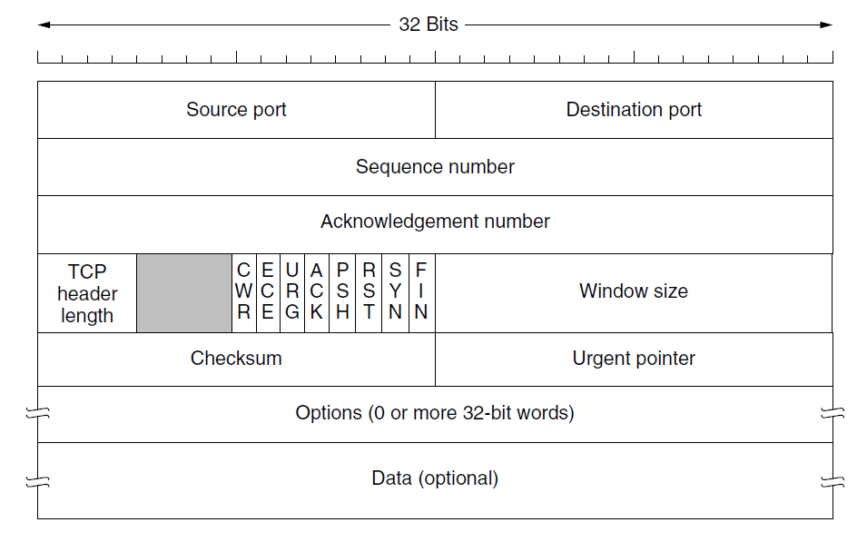

- [Socket Programming](#socket-programming)
  - [What is a Socket?](#what-is-a-socket)
  - [Key concepts](#key-concepts)
    - [TCP vs UDP](#tcp-vs-udp)
    - [Network Byte Order: `htonl()`, `htons()`, `ntohl()` and `ntohs()`](#network-byte-order-htonl-htons-ntohl-and-ntohs)
  - [Library Utils](#library-utils)
    - [`structs`](#structs)
      - [`addrinfo`](#addrinfo)
      - [`sockaddr`](#sockaddr)
      - [`sockaddr_in`](#sockaddr_in)
      - [`in_addr`](#in_addr)
      - [`sockaddr_in6` and `in6_addr`](#sockaddr_in6-and-in6_addr)
      - [`sockaddr_storage`](#sockaddr_storage)
    - [IP Address Conversion](#ip-address-conversion)
      - [`inet_pton()`](#inet_pton)
      - [`inet_ntop()`](#inet_ntop)
    - [System Calls](#system-calls)
      - [`getaddrinfo()`: Prepare to Launch](#getaddrinfo-prepare-to-launch)
      - [`getnameinfo()`: Ready for Launch?](#getnameinfo-ready-for-launch)
      - [`getpeername()`: Who are you?](#getpeername-who-are-you)
      - [`gethostname()`: Who am I?](#gethostname-who-am-i)
      - [`socket()`: Get the File Descriptor](#socket-get-the-file-descriptor)
      - [`bind()`: What port am I on?](#bind-what-port-am-i-on)
        - [`setsockopt()` and `getsockopt()`](#setsockopt-and-getsockopt)
      - [`connect()`: Hey you!](#connect-hey-you)
      - [`listen()`: Will somebody please call me?](#listen-will-somebody-please-call-me)
      - [`accept()`: Thank you for calling me!](#accept-thank-you-for-calling-me)
      - [`send()` and `recv()`: Talk to me Stream Sockets](#send-and-recv-talk-to-me-stream-sockets)
      - [`sendto()` and `recvfrom()`: Talk to me Datagram Sockets](#sendto-and-recvfrom-talk-to-me-datagram-sockets)
      - [`close()` and `shutdown()`: Get outta my face!](#close-and-shutdown-get-outta-my-face)
      - [`perror()` and `strerror()`: Oh No!](#perror-and-strerror-oh-no)
    - [Jumping from IPv4 to IPv6](#jumping-from-ipv4-to-ipv6)
    - [Others](#others)
      - [`inet_ntoa()`, `inet_aton()` and `inet_addr`](#inet_ntoa-inet_aton-and-inet_addr)
      - [Hostnames: `struct hostent`, `gethostbyname()` and `gethostbyaddr()`](#hostnames-struct-hostent-gethostbyname-and-gethostbyaddr)
      - [Network Names: `struct netent`](#network-names-struct-netent)
      - [Protocol Names: `struct protoent`](#protocol-names-struct-protoent)
      - [Service Names: `struct servent`](#service-names-struct-servent)
  - [Client-Server Communication](#client-server-communication)
    - [Procedure](#procedure)
    - [Steps on the `server` side](#steps-on-the-server-side)
    - [Steps on the `client` side](#steps-on-the-client-side)
- [Advanced Techniques](#advanced-techniques)
  - [Blocking: `fcntl()`](#blocking-fcntl)
  - [`poll()`: Synchronous I/O Multiplexing](#poll-synchronous-io-multiplexing)
  - [`select()`: Synchronous I/O Multiplexing, Old School](#select-synchronous-io-multiplexing-old-school)
  - [Handling partial `send()`s](#handling-partial-sends)
  - [Broadcasting Packets](#broadcasting-packets)
- [Raw Sockets](#raw-sockets)
  - [Ethernet Header](#ethernet-header)
  - [IPv4 Header](#ipv4-header)
    - [Generic checksum calculation function](#generic-checksum-calculation-function)
  - [TCP header](#tcp-header)
  - [UDP Header](#udp-header)
  - [Using Raw Sockets](#using-raw-sockets)
  - [Creating Packet Sniffers](#creating-packet-sniffers)
    - [Opening a Raw Socket to sniff Ethernet Headers also](#opening-a-raw-socket-to-sniff-ethernet-headers-also)
      - [Non-promiscuous and promiscuous mode](#non-promiscuous-and-promiscuous-mode)
    - [Reception of the Network Packet](#reception-of-the-network-packet)
    - [Extracting Header](#extracting-header)
      - [Ethernet Header](#ethernet-header-1)
      - [IP Header](#ip-header)
      - [TCP Header](#tcp-header-1)
      - [UDP Header](#udp-header-1)
    - [Extracting Data](#extracting-data)
  - [Sending packets with a raw socket](#sending-packets-with-a-raw-socket)
    - [What is `struct ifreq`?](#what-is-struct-ifreq)
    - [Get the Index of the Interface to Send a packet](#get-the-index-of-the-interface-to-send-a-packet)
    - [Get the MAC and IP address of the Interface](#get-the-mac-and-ip-address-of-the-interface)
    - [Store Interface Index in `struct sockaddr_ll`](#store-interface-index-in-struct-sockaddr_ll)
    - [Constructing the Headers and Sending the packet](#constructing-the-headers-and-sending-the-packet)

# Socket Programming

https://beej.us/guide/bgnet/html/#intro

-   Socket programming is a way of connecting two nodes on a network to communicate with each other
-   One socket(node) listens on a particular port at an IP (called the **server**), while the other socket reaches out to the other to form a connection (called the **client**)

## What is a Socket?

-   The socket we see in reality is a medium to connect two devices or systems
-   **They let applications attach to the local network at different ports**
-   Sockets are a mechanism for exchanging data between processes
    -   These processes can either be on the same machine, or on different machines connected via a network
-   Once a socket connection is established, data can be sent in both directions until one of the endpoints closes the connection

## Key concepts

-   Socket is a way of speaking to other programs using standard **file descriptors**
-   **Where do we get the file descriptor for network communication?**\
    Well, we make a call to the `socket()` system routine\
    After the `socket()` returns the socket descriptor, we start communicate through it using the specialized `send()/recv()` socket API calls
-   A TCP socket is an **endpoint instance**
-   A TCP socket is **not a connection**, it is the **endpoint** of a specific connection
-   A TCP connection is defined by **two endpoints** aka sockets
-   The purpose of **ports** is to **differentiate multiple endpoints** on a given network address
-   The port numbers are encoded in the transport protocol packet header, and they can be readily interpreted not only by the sending and receiving computers, but also by other components of the networking infrastructure
    -   In particular, firewalls are commonly configured to differentiate between packets based on their source or destination **port numbers** as in **port forwarding**
-   It is the **socket pair** (the **4-tuple** consisting of the client IP address, client port number, server IP address, and server port number) that specifies the two endpoints that uniquely identifies each **TCP connection** in an internet
-   Only **one process** may bind to a specific **IP address** and **port** combination using the **same transport protocol**
    -   Otherwise, we'll have **port conflicts**, where multiple programs attempt to bind to the same port numbers on the same IP address using the same protocol

To connect to another machine, we need a **socket connection**

What's a connection?

-   A **relationship** between two machines, where **two pieces of software know about each other**
-   They know how to communicate with each other i.e. how to send **bits** to each other
-   A socket connection means the two machines have information about each other, including **network location (IP address)** and **TCP port**
    -   IP address is the **phone number** and the TCP port is the **extension**
-   A socket is an object similar to a file that allows a program to accept incoming connections, make outgoing connections, and send and receive data
-   **Before two machines can communicate, both must create a socket object**
-   A socket is a **resource** assigned to the server process. The server creates it using the system call `socket()`, and it can't be shared with other processes

### TCP vs UDP

-   There are **stream** sockets and the **datagram** sockets that determine the structure of the transport layer


-   **Stream Sockets**:
    -   Stream sockets provide **reliable two-way** communication similar to when we call someone on the phone
    -   One side initiates the connection to the other, and after the connection is established, either side can communicate to the other
    -   There is immediate confirmation that what we said actually reached its destination
    -   Stream sockets use a **Transmission Control Protocol (TCP)**, which exists on the transport layer of the Open Systems Interconnection (OSI) model
    -   The data is usually transmitted in packets
    -   TCP is designed so that the packets of data will arrive without errors and in sequence
    -   Webservers, mail servers, and their respective client applications all use TCP and stream socket to communicate
-   **Datagram Sockets**:
    -   Communicating with a datagram socket is more like mailing a letter than making a phone call i.e. the connection is **one-way** only and **unreliable**
    -   We can't be sure that packets arrive in the same order, or even that they reached their destination at all
    -   Datagram sockets use **User Datagram Protocol (UDP)**
    -   It's not a real connection, just a basic method for sending data from one point to another
    -   Datagram sockets and UDP are commonly used in networked games and streaming media
    -   Services provided by UDP are typically used where a client needs to make a short query of a server and expects a single short response
    -   To access a service from UDP, we need to use the UDP specific system calls, `sendto()` and `recvfrom()` instead of `read()` and `write()` on the socket
    -   UDP is used by app that doesn't want reliability or bytestreams
        -   Voice-over-ip (unreliable) such as conference call
        -   DNS, RPC (message-oriented)
        -   DHCP (bootstrapping)

### Network Byte Order: `htonl()`, `htons()`, `ntohl()` and `ntohs()`

-   The port number and IP address used in the **AF_INET** socket address structure are expected to follow the network byte ordering (big-endian)
-   Hence, we want to **convert the numbers to Network Byte Order** before they go out on the wire, and **convert them to Host Byte Order** as they come in off the wire
-   There are specialized functions for the conversions, and they are defined in `netinet.h` and `arpa/inet.h`

```cpp
htonl(long value)  // Host-to-Network Long
// Converts a 32-bit integer from the host's byte order to network byte order.

htons(short value) // Host-to-Network Short
// Converts a 16-bit integer from the host's byte order to network byte order.

ntohl(long value)  // Network-to-Host Long
// Converts a 32-bit integer from network byte order to the host's byte order.

ntohs(short value) // Network-to-Host Short
// Converts a 16-bit integer from network byte order to the host's byte order
```

## Library Utils

**Sockets**, in C, behaves like files because they use file descriptors to identify themselves. Sockets behave so much like files that we can use the `read()` and `write()` to receive and send data using **socket file descriptors**

File: **/usr/include/sys/sockets.h**

### `structs`

#### `addrinfo`

```cpp
struct addrinfo {
    int              ai_flags;     // AI_PASSIVE, AI_CANONNAME, etc.
    int              ai_family;    // AF_INET, AF_INET6, AF_UNSPEC
    int              ai_socktype;  // SOCK_STREAM, SOCK_DGRAM
    int              ai_protocol;  // use 0 for "any"
    size_t           ai_addrlen;   // size of ai_addr in bytes
    struct sockaddr *ai_addr;      // struct sockaddr_in or _in6
    char            *ai_canonname; // full canonical hostname

    struct addrinfo *ai_next;      // linked list, next node
};
```

#### `sockaddr`

```cpp
struct sockaddr {
    unsigned short    sa_family;    // address family, AF_xxx
    char              sa_data[14];  // 14 bytes of protocol address
};
```

#### `sockaddr_in`

```cpp
// (IPv4 only--see struct sockaddr_in6 for IPv6)
struct sockaddr_in {
    short int          sin_family;  // Address family, AF_INET
    unsigned short int sin_port;    // Port number
    struct in_addr     sin_addr;    // Internet address
    unsigned char      sin_zero[8]; // Same size as struct sockaddr
};
```

-   **sin_family** = specifies the address family\
    **sin_addr** = Holds the IP address to be used in the socket connection\
    **sin_port** = specifies the port number and must be used with `htons()` function that converts the **host byte order** to **network byte order** so that it can be transmitted and routed properly when opening the socket connection

#### `in_addr`

```cpp
// (IPv4 only--see struct in6_addr for IPv6)

// Internet address (a structure for historical reasons)
struct in_addr {
    uint32_t s_addr; // that's a 32-bit int (4 bytes)
};
```

#### `sockaddr_in6` and `in6_addr`

```cpp
// (IPv6 only--see struct sockaddr_in and struct in_addr for IPv4)

struct sockaddr_in6 {
    u_int16_t       sin6_family;   // address family, AF_INET6
    u_int16_t       sin6_port;     // port number, Network Byte Order
    u_int32_t       sin6_flowinfo; // IPv6 flow information
    struct in6_addr sin6_addr;     // IPv6 address
    u_int32_t       sin6_scope_id; // Scope ID
};

struct in6_addr {
    unsigned char   s6_addr[16];   // IPv6 address
};
```

#### `sockaddr_storage`

```cpp
struct sockaddr_storage {
    sa_family_t  ss_family;     // address family

    // all this is padding, implementation specific, ignore it:
    char      __ss_pad1[_SS_PAD1SIZE];
    int64_t   __ss_align;
    char      __ss_pad2[_SS_PAD2SIZE];
};
```

### IP Address Conversion

**arpa/inet.h**

#### `inet_pton()`

-   `inet_pton()` converts an IP address in numbers-and-dot notation into either a `struct in_addr` or a `struct in6_addr`
-   It returns `-1` on error
-   Printable form to Network form

```cpp
struct sockaddr_in sa; // IPv4
struct sockaddr_in6 sa6; // IPv6

inet_pton(AF_INET, "10.12.110.57", &(sa.sin_addr)); // IPv4
inet_pton(AF_INET6, "2001:db8:63b3:1::3490", &(sa6.sin6_addr)); // IPv6
```

#### `inet_ntop()`

-   `inet_ntop()` converts an `in_addr` or `in6_addr` into printable form

```cpp
// IPv4:

char ip4[INET_ADDRSTRLEN];  // space to hold the IPv4 string
struct sockaddr_in sa;      // pretend this is loaded with something

inet_ntop(AF_INET, &(sa.sin_addr), ip4, INET_ADDRSTRLEN);

printf("The IPv4 address is: %s\n", ip4);
```

```cpp
// IPv6:

char ip6[INET6_ADDRSTRLEN]; // space to hold the IPv6 string
struct sockaddr_in6 sa6;    // pretend this is loaded with something

inet_ntop(AF_INET6, &(sa6.sin6_addr), ip6, INET6_ADDRSTRLEN);

printf("The address is: %s\n", ip6);
```

### System Calls

#### `getaddrinfo()`: Prepare to Launch

```cpp
#include <sys/types.h>
#include <sys/socket.h>
#include <netdb.h>

int getaddrinfo(const char *node,     // e.g. "www.example.com" or IP
                const char *service,  // e.g. "http" or port number
                const struct addrinfo *hints,
                struct addrinfo **res);
```

-   Does DNS and service name lookups
-   Gives pointer to a **linked-list**, `res`, of results

```cpp
// Example
int status;
struct addrinfo hints;
struct addrinfo *servinfo;  // will point to the results

memset(&hints, 0, sizeof hints); // make sure the struct is empty
hints.ai_family = AF_UNSPEC;     // don't care IPv4 or IPv6
hints.ai_socktype = SOCK_STREAM; // TCP stream sockets
hints.ai_flags = AI_PASSIVE;     // fill in my IP for me

if ((status = getaddrinfo("www.example.net", "3490", &hints, &servinfo)) != 0) {
    fprintf(stderr, "getaddrinfo error: %s\n", gai_strerror(status));
    exit(1);
}

// servinfo now points to a linked list of 1 or more struct addrinfos

// ... do everything until you don't need servinfo anymore ....

freeaddrinfo(servinfo); // free the linked-list
```

-   **Example:** [showip.cpp](socket_programming/showip.cpp)

#### `getnameinfo()`: Ready for Launch?

```cpp
#include <sys/socket.h>
#include <netdb.h>

int getnameinfo(const struct sockaddr *sa, socklen_t salen,
                char *host, size_t hostlen,
                char *serv, size_t servlen, int flags);
```

-   Look up the host name and service name information for a given struct sockaddr
-   Opposite for `getaddrinfo()`, i.e. it takes already loaded `struct sockaddr` and does a name and service name lookup on it
-   Result will be in `host` and `serv` parameters

```cpp
// Example
struct sockaddr_in6 sa; // could be IPv4 if you want
char host[1024];
char service[20];

// pretend sa is full of good information about the host and port...

getnameinfo(&sa, sizeof sa, host, sizeof host, service, sizeof service, 0);

printf("   host: %s\n", host);    // e.g. "www.example.com"
printf("service: %s\n", service); // e.g. "http"
```

#### `getpeername()`: Who are you?

```cpp
#include <sys/socket.h>

int getpeername(int sockfd, struct sockaddr *addr, socklen_t *addrlen)
```

-   Tell who is at the other end of the connected stream socket
-   Returns `-1` on error

#### `gethostname()`: Who am I?

```cpp
#include <unistd.h>

int gethostname(char *hostname, size_t size);
```

-   It returns the name of the computer that our program is running on
-   The name can then be used by `getaddrinfo()` to determine the IP address of our local machine
-   `hostname` is a pointer to an array of chars that will contain the hostname upon the function's return

#### `socket()`: Get the File Descriptor

```cpp
#include <sys/types.h>
#include <sys/socket.h>

int socket(int domain, int type, int protocol);
```

-   Used to create a new socket
-   Returns a file descriptor for the socket or `-1` on error
-   **Parameters**:
    -   **Domain**:
        -   Protocol family of socket being requested
        -   Should be `AF_INET` or `AF_INET6`
    -   **Type**:
        -   Type of socket within that family
        -   Either `SOCK_STREAM` for TCP/IP or `SOCK_DGRAM` for UDP/IP
    -   **Protocol**:
        -   Usually set to `0` to indicate that the default protocol should be used
-   The address families, protocol families and type of sockets are defined in **bits/socket.h**, which is automatically included from **sys/socket.h**

```cpp
/* Address families.  */
#define AF_UNSPEC       PF_UNSPEC
#define AF_LOCAL        PF_LOCAL
#define AF_UNIX         PF_UNIX
#define AF_FILE         PF_FILE
#define AF_INET         PF_INET
#define AF_AX25         PF_AX25
#define AF_IPX          PF_IPX
#define AF_APPLETALK    PF_APPLETALK
#define AF_NETROM       PF_NETROM
#define AF_BRIDGE       PF_BRIDGE
#define AF_ATMPVC       PF_ATMPVC
#define AF_X25          PF_X25
#define AF_INET6        PF_INET6
#define AF_ROSE         PF_ROSE
#define AF_DECnet       PF_DECnet
#define AF_NETBEUI      PF_NETBEUI
#define AF_SECURITY     PF_SECURITY
#define AF_KEY          PF_KEY
#define AF_NETLINK      PF_NETLINK
#define AF_ROUTE        PF_ROUTE
#define AF_PACKET       PF_PACKET
#define AF_ASH          PF_ASH
#define AF_ECONET       PF_ECONET
#define AF_ATMSVC       PF_ATMSVC
#define AF_SNA          PF_SNA
#define AF_IRDA         PF_IRDA
#define AF_PPPOX        PF_PPPOX
#define AF_WANPIPE      PF_WANPIPE
#define AF_BLUETOOTH    PF_BLUETOOTH
#define AF_MAX          PF_MAX
```

```cpp
/* Types of sockets.  */
enum __socket_type
{
  SOCK_STREAM = 1,              /* Sequenced, reliable, connection-based
                                   byte streams.  */
#define SOCK_STREAM SOCK_STREAM
  SOCK_DGRAM = 2,               /* Connectionless, unreliable datagrams
                                   of fixed maximum length.  */
#define SOCK_DGRAM SOCK_DGRAM
  SOCK_RAW = 3,                 /* Raw protocol interface.  */
#define SOCK_RAW SOCK_RAW
  SOCK_RDM = 4,                 /* Reliably-delivered messages.  */
#define SOCK_RDM SOCK_RDM
  SOCK_SEQPACKET = 5,           /* Sequenced, reliable, connection-based,
                                   datagrams of fixed maximum length.  */
#define SOCK_SEQPACKET SOCK_SEQPACKET
  SOCK_PACKET = 10              /* Linux specific way of getting packets
                                   at the dev level.  For writing rarp and
                                   other similar things on the user level. */
#define SOCK_PACKET SOCK_PACKET
};
```

```cpp
/* Protocol families.  */
#define PF_UNSPEC       0       /* Unspecified.  */
#define PF_LOCAL        1       /* Local to host (pipes and file-domain).  */
#define PF_UNIX         PF_LOCAL /* Old BSD name for PF_LOCAL.  */
#define PF_FILE         PF_LOCAL /* Another non-standard name for PF_LOCAL.  */
#define PF_INET         2       /* IP protocol family.  */
#define PF_AX25         3       /* Amateur Radio AX.25.  */
#define PF_IPX          4       /* Novell Internet Protocol.  */
#define PF_APPLETALK    5       /* Appletalk DDP.  */
#define PF_NETROM       6       /* Amateur radio NetROM.  */
#define PF_BRIDGE       7       /* Multiprotocol bridge.  */
#define PF_ATMPVC       8       /* ATM PVCs.  */
#define PF_X25          9       /* Reserved for X.25 project.  */
#define PF_INET6        10      /* IP version 6.  */
#define PF_ROSE         11      /* Amateur Radio X.25 PLP.  */
#define PF_DECnet       12      /* Reserved for DECnet project.  */
#define PF_NETBEUI      13      /* Reserved for 802.2LLC project.  */
#define PF_SECURITY     14      /* Security callback pseudo AF.  */
#define PF_KEY          15      /* PF_KEY key management API.  */
#define PF_NETLINK      16
#define PF_ROUTE        PF_NETLINK /* Alias to emulate 4.4BSD.  */
#define PF_PACKET       17      /* Packet family.  */
#define PF_ASH          18      /* Ash.  */
#define PF_ECONET       19      /* Acorn Econet.  */
#define PF_ATMSVC       20      /* ATM SVCs.  */
#define PF_SNA          22      /* Linux SNA Project */
#define PF_IRDA         23      /* IRDA sockets.  */
#define PF_PPPOX        24      /* PPPoX sockets.  */
#define PF_WANPIPE      25      /* Wanpipe API sockets.  */
```

```cpp
// Example
int s;
struct addrinfo hints, *res;

// do the lookup
// [pretend we already filled out the "hints" struct]
getaddrinfo("www.example.com", "http", &hints, &res);

// again, you should do error-checking on getaddrinfo(), and walk
// the "res" linked list looking for valid entries instead of just
// assuming the first one is good (like many of these examples do).
// See the section on client/server for real examples.

s = socket(res->ai_family, res->ai_socktype, res->ai_protocol);
```

#### `bind()`: What port am I on?

```cpp
#include <sys/types.h>
#include <sys/socket.h>

int bind(int sockfd, struct sockaddr *local_addr, socklen_t addrlen)
```

-   Associate socket with a port on our local machine
-   The port number is used by the kernel to match an incoming packet to a certain process's socket descriptor
-   Server will call `bind()` with the address of the local host and the port on which it will listen for connections
-   Returns `0` on success and `-1` on error
-   **Parameters**:
    -   **sockfd**: file descriptor (previously established socket)
    -   Pointer to structure containing details of the address to bind to, the value `INADDR_ANY` is typically used for this. It will depend on the protocol which is used.
    -   Length of the address structure
-   `bind()` call will bind the socket with the current IP address on the specified port

##### `setsockopt()` and `getsockopt()`

```cpp
#include <sys/types.h>
#include <sys/socket.h>

int getsockopt(int s, int level, int optname, void *optval, socklen_t *optlen);

int setsockopt(int s, int level, int optname, const void *optval, socklen_t optlen);
```

```cpp
// Option Names

// Bind this socket to a symbolic device name like `eth0`
// instead of using bind() to bind it to an IP address.
SO_BINDTODEVICE

// Allows other sockets to bind() to this port
// unless there is an active listening socket bound to the port already
SO_REUSEADDR

// Allows UDP datagram (SOCK_DGRAM) sockets to send and receive packets
// sent to and from the broadcast address.
// Does nothing—NOTHING!!—to TCP stream sockets!
SOCK_DGRAM
```

```cpp
// Example

int optval;
int optlen;
char *optval2;

// set SO_REUSEADDR on a socket to true (1):
optval = 1;
setsockopt(s1, SOL_SOCKET, SO_REUSEADDR, &optval, sizeof optval);

// bind a socket to a device name (might not work on all systems):
optval2 = "eth1"; // 4 bytes long, so 4, below:
setsockopt(s2, SOL_SOCKET, SO_BINDTODEVICE, optval2, 4);

// see if the SO_BROADCAST flag is set:
getsockopt(s3, SOL_SOCKET, SO_BROADCAST, &optval, &optlen);
if (optval != 0) {
    print("SO_BROADCAST enabled on s3!\n");
}
```

-   Sometimes, when we try to rerun a server and `bind()` fails, claiming **Address already in use** What does that mean? Well, a little bit of a socket that was connected is still hanging around in the kernel, and it's hogging the port. We can either wait for it to clear (a minute or so), or add our code to the program allowing it to reuse the port

```cpp
int yes=1;

// lose the pesky "Address already in use" error message
if (setsockopt(listener, SOL_SOCKET, SO_REUSEADDR, &yes, sizeof(yes)) == -1) {
    perror("setsockopt");
    exit(1);
}
```

#### `connect()`: Hey you!

```cpp
 #include <sys/types.h>
#include <sys/socket.h>

int connect(int sockfd, struct sockaddr *serv_addr, socklen_t addrlen)
```

-   Connects a socket to a remote host
-   Returns `0` on success and `-1` on error
-   This is a **blocking call** i.e. our program doesn't regain control until either the connection is made, or an error occurs

```cpp
// Example
struct addrinfo hints, *res;
int sockfd;

// first, load up address structs with getaddrinfo():
memset(&hints, 0, sizeof hints);
hints.ai_family = AF_UNSPEC;
hints.ai_socktype = SOCK_STREAM;

getaddrinfo("www.example.com", "3490", &hints, &res);

// make a socket:
sockfd = socket(res->ai_family, res->ai_socktype, res->ai_protocol);

// connect!
connect(sockfd, res->ai_addr, res->ai_addrlen);
```

#### `listen()`: Will somebody please call me?

```cpp
int listen(int sockfd, int backlog_queue_size);
```

-   After binding to an address, server can call `listen()` on the socket
-   Returns `0` on success and `-1` on error
-   **Parameters**:
    -   Socket file descriptor
    -   Maximum number of queued connections requests up to **backlog_queue_size**

#### `accept()`: Thank you for calling me!

```cpp
#include <sys/types.h>
#include <sys/socket.h>

int accept(int sockfd, struct sockaddr *client_addr, socklen_t *addrlen)
```

-   Accepts an incoming connection on a bound socket
-   Returns a new socket file descriptor for the accepted connection or `-1` on error
-   **Parameters**:
    -   Socket file descriptor
    -   Address information from the remote host is written into the **remote_host** structure
    -   Actual size of the address structure is written into the **addr_length**
-   It will write the connecting client's address info into the address structure
-   Original socket file descriptor can continue to be used for accepting new connections while the new socket file descriptor is used for communicating with the connected client using `send()` and `recv()`
-   If no pending connections are present on the queue, and the socket is not marked as nonblocking, `accept()` will **block** the caller until a connection is present

#### `send()` and `recv()`: Talk to me Stream Sockets

-   For **Stream Sockets**

```cpp
int send(int sockfd, const void *buffer, size_t len, int flags);
```

-   Sends `n` bytes from `*buffer` to **sockfd**
-   Returns the number of bytes sent or `-1` on error

```cpp
int recv(int sockfd, void *buffer, size_t len, int flags);
```

-   Receives `n` bytes into `*buffer` from **sockfd**
-   Returns the number of bytes received or `-1` on error
-   Returns `0` if the remote connection is closed
-   This is **blocking call** i.e. control isn't returned to our program until at least one byte of data is read from the remote site

#### `sendto()` and `recvfrom()`: Talk to me Datagram Sockets

-   For **Datagram Sockets**
-   If while calling `connect()`, we specify the listener's address, then from that point onwards, we may only send to and receive from the address specified by the `connect()`, hence we need not use `sendto()` and `recvfrom()`, and we can simply use `send()` and `recv()`

```cpp
int sendto(int sockfd, const void *msg, size_t len, unsigned int flags,
                const struct sockaddr *to, socklen_t tolen);
```

-   We need to provide destination IP address and port also
-   Returns the number of bytes sent or `-1` on error

```cpp
int recvfrom(int sockfd, void *buf, size_t len, unsigned int flags,
                struct sockaddr *from, socklen_t *fromlen);
```

-   Returns the number of bytes received or -1 on error

#### `close()` and `shutdown()`: Get outta my face!

```cpp
close(sockfd);
```

-   This will prevent any more reads and writes to the socket
-   Anyone attempting to read or write the socket on the remote end will receive an error
-   Returns `0` on success and `-1` on error

```cpp
shutdown(sockfd);
```

-   Returns `0` on success and `-1` on error
-   Prevents further communication over the socket, but don't actually close the socket file descriptor

#### `perror()` and `strerror()`: Oh No!

```cpp
#include <stdio.h>
#include <string.h>   // for strerror()

void perror(const char *s);
char *strerror(int errnum);
```

-   Prints an error as a human-readable string
-   Since so many functions return `-1` on error and set the value of the variable `errno` to be some number, it would sure be nice if we could easily print that
-   `errno` is a special variable that contains the error code for the last system call

```cpp
s = socket(PF_INET, SOCK_STREAM, 0);

if (s == -1) { // some error has occurred
    // prints "socket error: " + the error message:
    perror("socket error");
}
```

### Jumping from IPv4 to IPv6

-   Try to use `getaddrinfo()` to get all the `struct sockaddr` info
-   Change `AF_INET` to `AF_INET6`
-   Change `PF_INET` to `PF_INET6`
-   Change `INADDR_ANY` assignments to `in6addr_any` assignments
-   The value `IN6ADDR_ANY_INIT` can be used as an initializer when the struct `in6_addr` is declared
    ```cpp
    struct in6_addr ia6 = IN6ADDR_ANY_INIT;
    ```
-   Instead of `struct sockaddr_in` use `struct sockaddr_in6`
-   Instead of `struct in_addr` use `struct in6_addr`
-   Instead of `inet_aton()` or `inet_addr()`, use `inet_pton()`
-   Instead of `inet_ntoa()`, use `inet_ntop()`
-   Instead of `gethostbyname()`, use the superior `getaddrinfo()`
-   Instead of `gethostbyaddr()`, use the superior `getnameinfo()`

### Others

#### `inet_ntoa()`, `inet_aton()` and `inet_addr`

**ALL THESE ARE DEPRECATED! as they don't handle IPv6. Use `inet_pton()` or `inet_ntop()` instead!!**

-   Convert IP addresses from a dots-and-number string to a `struct in_addr` and back

```cpp
#include <netinet/in.h>
#include <arpa/inet.h>

char *inet_ntoa(struct in_addr in);
int inet_aton(const char *cp, struct in_addr *inp);
in_addr_t inet_addr(const char *cp);    // Same as `inet_aton`
```

#### Hostnames: `struct hostent`, `gethostbyname()` and `gethostbyaddr()`

_**Note**: These two functions are superseded by `getaddrinfo()` and `getnameinfo()` In particular, `gethostbyname()` doesn’t work well with IPv6._

-   Takes an Internet hostname and returns a `hostent` structure

```cpp
struct hostent *gethostbyname(const char *name);  // DEPRECATED!

struct hostent *gethostbyaddr(const char *addr, int len, int type);
```

```cpp
struct hostent {
    // The real canonical host name
    char *h_name;

    // A list of aliases that can be accessed with arrays - the last element is `NULL`
    char **h_aliases;

    // The result’s address type, which really should be AF_INET for our purposes
    int  h_addrtype;

    // The length of the addresses in bytes, which is 4 for IP (version 4) addresses
    int  h_length;

    // A list of IP addresses for this host
    // Although this is a char**, it's really an array of `struct in_addr*s`
    // The last array element is `NULL`
    char **h_addr_list;

    // A commonly defined alias for `h_addr_list[0]`
    // If we just want any old IP address for this host just use this field
    h_addr
};
```

```cpp
// Example

struct hostent *he;

if ((he = gethostbyname("www.google.com")) == NULL) {  // get the host info
    herror("gethostbyname");
    return 2;
}

// print information about this host:
printf("Official name is: %s\n", he->h_name);

printf("    IP addresses: ");
struct in_addr **addr_list; = (struct in_addr **)he->h_addr_list;

for (int i = 0; addr_list[i] != NULL; i++) {
    printf("%s ", inet_ntoa(*addr_list[i]));
}
```

```cpp
// Example


struct in_addr ipv4addr;

inet_pton(AF_INET, "192.0.2.34", &ipv4addr);
struct hostent *he; he = gethostbyaddr(&ipv4addr, sizeof(ipv4addr), AF_INET);
printf("Host name: %s\n", he->h_name);
```

#### Network Names: `struct netent`

```cpp
struct netent {
    char *n_name;         /* official name of net */
    char **n_aliases;     /* alias list */
    int n_addrtype;       /* net address type */
    unsigned long n_net;  /* network number, host-byte order */
};
```

-   Functions: `getnetbyname()`, `getnetbyaddr()` and `getnetent()`

#### Protocol Names: `struct protoent`

```cpp
struct protoent {
    char *p_name;         /* official protocol name */
    char **p_aliases;     /* alias list */
    int  p_proto;         /* protocol number */
};
```

-   Functions: `getprotobyname()`, `getprotobynumber()`, and `getprotoent()`

#### Service Names: `struct servent`

```cpp
struct servent {
    char *s_name;         /* official service name */
    char **s_aliases;     /* alias list */
    int s_port;           /* port number, network-byte order */
    char *s_proto;        /* protocol to use */
};
```

-   Functions: `getservbyname()`, `getservbyport()` and `getservent()`

## Client-Server Communication

### Procedure

-   `Server Socket`
    -   **Create a Socket**: Get the file descriptor
    -   **Bind to an address**: What port am I on?
    -   **Listen on a port (only TCP)**: Wait for a connection to be established
    -   **Accept (only TCP)**: Connection request from client
    -   **Send/Receive**: Send/Receive some data over a connection in the same way we read/write for a file
    -   **Shutdown**: To end read/write
    -   **Close**: Release the connection and the data
-   `Client Socket`
    -   **Create a Socket**: Get the file descriptor
    -   **Connect (only TCP)**: Establish a connection to the server
    -   **Send/Receive**: Repeat until we have or receive data
    -   **Shutdown**: To end read/write
    -   **Close**: Release the connection and the data

**Examples**

[TCPServer.cpp](socket_programming/TCPServer.cpp) and [TCPClient.cpp](socket_programming/TCPClient.cpp)

[UDPServer.cpp](socket_programming/UDPServer.cpp) and [UDPClient.cpp](socket_programming/UDPClient.cpp)

### Steps on the `server` side

-   Create a socket with the `socket()` system call
-   The server process gives the socket a name
    -   In linux file system, local sockets are given a filename, under `/tmp` or `/usr/tmp` directory
    -   For network sockets, the filename will be a service identifier, port number, to which the clients can make connection
    -   This identifier allows to route incoming connections (which has that the port number) to connect server process
    -   A socket is named using `bind()` system call
-   The server process then waits for a client to connect to the named socket, which is basically listening for connections with the `listen()` system call
    -   If there are more than one client are trying to make connections, the `listen()` system call make a queue
    -   The machine receiving the connection (the server) must bind its socket object to a known port number
    -   A port is a 16-bit number in the range **0-65535** that's managed by the operating system and used by clients to uniquely identify servers
    -   Ports **0-1023** are reserved by the system and used by common network protocols
-   Accept a connection with the `accept()` system call
    -   At `accept()`, a new socket is created that is distinct from the named socket
    -   This new socket is used solely for communication with this particular client
    -   For TCP servers, the socket object used to receive connections is not the same socket used to perform subsequent communication with the client
    -   In particular, the `accept()` system call returns a new socket object that's actually used for the connection
    -   This allows a server to manage connections from a large number of clients simultaneously
-   Send and receive data
-   The named socket remains for further connections from other clients

### Steps on the `client` side

-   Create a socket with the `socket()` system call
-   Connect the socket to the address of the server using the `connect()` system call
-   Send and receive data. There are a number of ways to do this, but the simplest is to use the `read()` and `write()` system calls


# Advanced Techniques

## Blocking: `fcntl()`

-   The `accept()`, `connect()`, `recv()` and `recvfrom()` functions are blocking calls
-   When we first create the socket descriptor with `socket()`, the kernel sets it to blocking
-   If we don't want a socket to be blocking, we have to make a call to `fcntl()`

```cpp
#include <unistd.h>
#include <fcntl.h>

sockfd = socket(AF_INET, SOCK_STREAM, 0);
fcntl(sockfd, F_SETFL, O_NONBLOCK);
```

-   By setting a socket to non-blocking, we can effectively **poll** the socket for information
-   If we try to read from a non-blocking socket and there's no data there, it's not allowed to block — it will return `-1` and `errno` will be set to `EAGAIN` or `EWOULDBLOCK`
-   **This type of polling is a bad idea**

## `poll()`: Synchronous I/O Multiplexing

-   What we really want to be able to do is somehow monitor a bunch of sockets at once and then handle the ones that have data ready
-   This way we don't have to continously poll all those sockets to see which are ready to read
-   We can avoid polling by using the `poll()` system call
-   In a nutshell, we're going to ask the operating system to do all the dirty work for us, and just let us know when some data is ready to read on which sockets
-   In the meantime, our process can go to sleep, saving system resources
-   The general gameplan is to keep an array of `struct pollfds` with information about which socket descriptors we want to monitor, and what kind of events we want to monitor for. The OS will block on the `poll()` call until one of those events occurs (e.g. "socket ready to read!") or until a user-specified timeout occurs
-   Usefully, a `listen()`ing socket will return "ready to read" when a new incoming connection is ready to be `accept()`ed

```cpp
#include <poll.h>

int poll(struct pollfd fds[], nfds_t nfds, int timeout);
```

-   **fds**: array of information about which sockets to monitor\
    **nfds**: count of elements in the array\
    **timeout**: timeout in milliseconds
-   Returns the number of elements in the pfds array for which events have occurred

```cpp
struct pollfd {
    int fd;         // the socket descriptor
    short events;   // bitmap of events we're interested in
    short revents;  // when poll() returns, bitmap of events that occurred
};
```

-   `events` fields is bitmap-OR of the following:
    ```cpp
    POLLIN    // Alert me when data is ready to recv() on this socket.
    POLLOUT	  // Alert me when I can send() data to this socket without blocking.
    ```

```cpp
#include <poll.h>
#include <stdio.h>

int main() {
    struct pollfd pfds[1];  // More if we want to monitor more

    pfds[0].fd = 0;           // Standard input
    pfds[0].events = POLLIN;  // Tell me when ready to read

    // If we needed to monitor other things, as well:
    // pfds[1].fd = some_socket; // Some socket descriptor
    // pfds[1].events = POLLIN;  // Tell me when ready to read

    printf("Hit RETURN or wait 2.5 seconds for timeout\n");

    int num_events = poll(pfds, 1, 2500);  // 2.5 second timeout

    if (num_events == 0) {
        printf("Poll timed out!\n");
    } else {
        int pollin_happened = pfds[0].revents & POLLIN;

        if (pollin_happened) {
            printf("File descriptor %d is ready to read\n", pfds[0].fd);
        } else {
            printf("Unexpected event occurred: %d\n", pfds[0].revents);
        }
    }

    return 0;
}

```

-   **How to add new file descriptors to the set passed to `poll()`?**: Make sure we have enough space in the array for all we need, or `realloc()` more space as needed
-   **How to delete items from the set of file descriptors?**:
    -   We can copy the last element in the array over-top the one we're deleting and then pass in one fewer as the count to `poll()`
    -   Another option is that we can set any fd field to a negative number and `poll()` will ignore it
-   **Example**: [polling.cpp](socket_programming/advanced/polling.cpp)

## `select()`: Synchronous I/O Multiplexing, Old School

-   **Consider the situation**: We are a server and we want to listen for incoming connections as well as keep reading from the connections we already have
-   `select()` gives the power to monitor several sockets at the same time
-   It'll tell us which ones are ready for reading, which are ready for writing, and which sockets have raised exceptions, if we really want to know that

```cpp
#include <sys/time.h>
#include <sys/types.h>
#include <sys/select.h>
#include <unistd.h>

int select(int numfds, fd_set *readfds, fd_set *writefds,
            fd_set *exceptfds, struct timeval *timeout);
```

-   Mointors **sets** of file descriptors, in particular `readfds`, `writefds` and `exceptfds`
-   The parameter **numfds** should be set to the values of the highest file descriptor plus one
-   The time structure allows to specify a timeout period. If the time is exceeded and `select()` still hasn't found any ready file descriptors, it'll return so we can continue processing

    ```cpp
    struct timeval {
        int tv_sec;     // seconds
        int tv_usec;    // microseconds
    };
    ```

    -   If we set the fields in our `struct timeval` to `0`, `select()` will timeout immediately, effectively polling all the file descriptors in our sets
    -   If we set the parameter timeout to `NULL`, it will never timeout, and will wait until the first file descriptor is ready

-   If we don't care about waiting for a certain set, we can just set it to `NULL` in the call to `select()`
-   When `select()` returns, `readfds` will be **modified** to reflect which of the file descriptors we selected which is ready for reading. We can test them with the macro `FD_ISSET()`
-   **Returns** the number of descriptors in the set on success, `0` if the timeout was reached, or `-1` on error

| Function                         | Description                       |
| -------------------------------- | --------------------------------- |
| `FD_SET(int fd, fd_set *set);`   | Add fd to the set                 |
| `FD_CLR(int fd, fd_set *set);`   | Remove fd from the set            |
| `FD_ISSET(int fd, fd_set *set);` | Return `true` if fd is in the set |
| `FD_ZERO(fd_set *set);`          | Clear all entries from the set    |

```cpp
#include <stdio.h>
#include <sys/time.h>
#include <sys/types.h>
#include <unistd.h>

#define STDIN 0  // file descriptor for standard input

int main() {
    struct timeval tv;
    fd_set readfds;

    tv.tv_sec = 2;
    tv.tv_usec = 500000;

    FD_ZERO(&readfds);
    FD_SET(STDIN, &readfds);

    // don't care about writefds and exceptfds:
    select(STDIN + 1, &readfds, NULL, NULL, &tv);

    if (FD_ISSET(STDIN, &readfds))
        printf("A key was pressed!\n");
    else
        printf("Timed out.\n");

    return 0;
}
```

-   **What happens if a socket in the read set closes the connection?**: `select()` returns with that socket descriptor set as “ready to read”. When we actually do `recv()` from it, `recv()` will return `0`. That's how we know the client has closed the connection
-   If you have a socket that is `listen()`ing, we can check to see if there is a new connection by putting that socket's file descriptor in the `readfds` set. A `listen()`ing socket will return "ready to read" when a new incoming connection is ready to be `accept()`ed
-   **Example**: [selectserver.cpp](socket_programming/advanced/selectserver.cpp)

## Handling partial `send()`s

```cpp
#include <sys/types.h>
#include <sys/socket.h>

int sendall(int s, char *buf, int *len)
{
    int total = 0;        // how many bytes we've sent
    int bytesleft = *len; // how many we have left to send
    int n;

    while(total < *len) {
        n = send(s, buf+total, bytesleft, 0);
        if (n == -1) { break; }
        total += n;
        bytesleft -= n;
    }

    *len = total; // return number actually sent here

    return n==-1?-1:0; // return -1 on failure, 0 on success
}

// Usage
char buf[10] = "Beej!";
int len;

len = strlen(buf);
if (sendall(s, buf, &len) == -1) {
    perror("sendall");
    printf("We only sent %d bytes because of the error!\n", len);
}
```

## Broadcasting Packets

-   We have to set the socket option `SO_BROADCAST` before we can send a broadcast packet out on the network
-   **How to specify the destination address for a broadcast message?**:
    -   Send the data to a specific subnet’s broadcast address
    -   Send the data to the **global** broadcast address i.e. `255.255.255.255`, aka `INADDR_BROADCAST`

```cpp
int broadcast = 1;
//char broadcast = '1'; // if that doesn't work, try this

// this call is what allows broadcast packets to be sent
if (setsockopt(sockfd, SOL_SOCKET, SO_BROADCAST, &broadcast, sizeof(broadcast)) == -1) {
    perror("setsockopt (SO_BROADCAST)");
    exit(1);
}
```

# Raw Sockets

https://www.pdbuchan.com/rawsock/rawsock.html

-   Raw sockets can be used to construct a packet manually inside an application. In normal sockets when any data is send over the network, the kernel of the operating system adds some headers to it like IP header and TCP header. So an application only needs to take care of what data it is sending and what reply it is expecting
-   But there are other cases when an application needs to set its own headers. Raw sockets are used in security related applications like **nmap**, **packets sniffer** etc.

## Ethernet Header


-   First comes a **Preamble of 8 bytes**, each containing the bit pattern **10101010** (with the exception of the last byte, in which the last 2 bits are set to 11). This last byte is called the **Start of Frame** delimiter for 802.3 (i.e. 7 - 10101010 and 1 - 10101011)
-   Next come two **MAC addresses**, one for the destination and one for the source. They are each **6 bytes long**
-   Next comes the **Type** or **Length** field, depending on whether the frame is Ethernet or IEEE 802.3. The **Type** field specifies which process to give the frame to
-   `Ethernet Header = Dest_Addr + Src_Addr + Type/Length = 6 + 6 + 2 = 14 bytes`

```cpp
#include <net/ethernet.h>  //For ether_header

struct ethhdr {
	unsigned char	h_dest[ETH_ALEN];	/* destination eth addr	*/
	unsigned char	h_source[ETH_ALEN];	/* source ether addr	*/
	/* unsigned short */
	__be16 		    h_proto;		/* packet type ID field	*/
};
```

## IPv4 Header


-   Checksum is 16-bit one's compliment of the one's compliment sum of all 16-bit words in the Header (i.e. before data)
    -   For computing it, header checksum is kept as 0
    -   At receiver end, computing header again should give 0
-   Format of the **Type of Service** field:
    ```txt
    Bits 0-2: Precedence
    	111 = Normal Control.
    	110 = Internetwork Control.
    	101 = CRITIC/ECP.
    	100 = Flash Override.
    	011 = Flash.
    	010 = Immediate.
    	001 = Priority.
    	000 = Routine.
    Bit 3 : Delay 0 = normal delay, 1 = low delay.
    Bit 4 : Throughput 0 = normal throughput, 1 = high throughput.
    Bit 5 : Reliability 0 = normal reliability, 1 = high reliability.
    Bits 6-7: Reserved
    ```

```cpp
#include <netinet/ip.h>   // Provides declarations for ip header

struct iphdr {
    unsigned int   version:4;
    unsigned int   ihl:4;
	uint8_t        tos;
    uint16_t       tot_len;
    uint16_t       id;
    uint16_t       frag_off;
    uint8_t        ttl;
    uint8_t        protocol;
    uint16_t       check;
    uint32_t       saddr;
    uint32_t       daddr;
	/* The options start here */
};  /* total IP header length: 20 bytes (= 160 bits) */

struct ip {
    unsigned int    ip_v:4;	        /* version */
    unsigned int    ip_hl:4;	        /* header length */
    uint8_t         ip_tos;	        /* type of service */
    unsigned short  ip_len;	        /* total length */
    unsigned short  ip_id;	        /* identification */
    unsigned short  ip_off;          /* fragment offset field */
    uint8_t         ip_ttl;	        /* time to live */
    uint8_t         ip_p;            /* protocol */
    unsigned short  ip_sum;          /* checksum */
    struct in_addr  ip_src, ip_dst;	/* source and dest address */
};
```

### Generic checksum calculation function

```cpp
unsigned short csum(unsigned short *ptr, int nbytes) {
    unsigned long sum = 0;
    /*
        using a 32 bit accumulator (sum), we add
        sequential 16 bit words to it, and at the end, fold back all the
        carry bits from the top 16 bits into the lower 16 bits.
    */
    while (nbytes > 1) {
        sum += *ptr++;
        nbytes -= 2;
    }

    /* mop up an odd byte, if necessary */
    if (nbytes == 1) {
        unsigned short oddbyte = 0;
        *((u_char *)&oddbyte) = *(u_char *)ptr;
        sum += oddbyte;
    }

    /* add back carry outs from top 16 bits to low 16 bits */
    sum = (sum >> 16) + (sum & 0xffff); /* add hi 16 to low 16 */
    sum = sum + (sum >> 16);            /* add carry */
    return (short)~sum;                 /* truncate to 16 bits */
}
```

## TCP header



-   **Minimum 20-byte header**
-   **TCP Header length - 4 bits**
-   After Header length: **Reserved bits - 4 bits**
-   The checksum field is the 16 bit one's complement of the one's complement sum of all 16 bit words in the header and text

    -   If a segment contains an odd number of header and text octets to be checksummed, the last octet is padded on the right with zeros to form a 16 bit word for checksum purposes
    -   While computing the checksum, the checksum field itself is replaced with zeros
    -   It is the checksum of pseudo header, tcp header and payload
    -   The checksum also covers a **96-bit pseudo header** conceptually prefixed to the TCP header. This pseudo header contains the Source Address, the Destination Address, the Protocol, and TCP length. This gives the TCP protection against misrouted segments. This information is carried in the Internet Protocol and is transferred across the TCP/Network interface in the arguments or results of calls by the TCP on the IP\
        

-   After the options, up to `65535 - 20 (IP) - 20 (TCP) = 65495` data bytes may follow

```cpp
#include <sys/types.h>
#include <netinet/tcp.h>  // Provides declarations for tcp header

struct tcphdr {
	uint16_t source;
	uint16_t dest;
	uint32_t seq;
	uint32_t ack_seq;
	uint16_t doff:4;
	uint16_t res1:4;
	uint16_t res2:2;
	uint16_t urg:1;
	uint16_t ack:1;
	uint16_t psh:1;
	uint16_t rst:1;
	uint16_t syn:1;
	uint16_t fin:1;
	uint16_t window;
	uint16_t check;
	uint16_t urg_ptr;
};

struct tcphdr {
	uint16_t th_sport;	/* source port */
	uint16_t th_dport;	/* destination port */
	tcp_seq  th_seq;	/* sequence number */
	tcp_seq  th_ack;	/* acknowledgement number */
	uint8_t  th_off:4;	/* data offset */
	uint8_t  th_x2:4;	/* (unused) */
	uint8_t  th_flags;
	uint16_t th_win;	/* window */
	uint16_t th_sum;	/* checksum */
	uint16_t th_urp;	/* urgent pointer */
};  /* total tcp header length: 20 bytes (= 160 bits) */

struct pseudo_header {
    u_int32_t source_address;
    u_int32_t dest_address;
    u_int8_t  placeholder;
    u_int8_t  protocol;
    u_int16_t tcp_length;
};	// 96-bit (12 bytes) pseudo header needed for tcp header checksum calculation
```

## UDP Header


-   UDP transmits segments consisting of an **8-byte header** followed by the payload
-   The UDP length field includes the 8-byte header and the data. The minimum length is 8 bytes, to cover the header. The maximum length is 65,515 bytes
-   Checksum is the 16-bit one's complement of the one's complement sum of a pseudo header of information from the IP header, the UDP header, and the data, padded with zero octets at the end (if necessary) to make a multiple of two octets\
    

```cpp
#include <sys/types.h>
#include <netinet/udp.h>  //Provides declarations for udp header

struct udphdr {
	uint16_t uh_sport;	/* source port */
	uint16_t uh_dport;	/* destination port */
	uint16_t uh_ulen;	/* udp length */
	uint16_t uh_sum;	/* udp checksum */
};

struct udphdr {
      uint16_t source;  /* source port */
      uint16_t dest;    /* destination port */
      uint16_t len;     /* udp length */
      uint16_t check;   /* udp checksum */
};  /* total udp header length: 8 bytes (= 64 bits) */


struct pseudo_header {
    u_int32_t source_address;
    u_int32_t dest_address;
    u_int8_t  placeholder;
    u_int8_t  protocol;
    u_int16_t udp_length;
};	// 96 bit (12 bytes) pseudo header needed for udp header checksum calculation
```

## Using Raw Sockets

A Transport Layer Packet: `Packet = IP Header + Transport Header + Data`

Actual Packet: `Packet = Ethernet Header + IP Header + Transport Header + Data`

`+` means to attach the binary data side by side

**Create a Raw Socket**

```cpp
#include <sys/socket.h>
#include <netinet/in.h>

// TCP Socket
int s = socket(AF_INET, SOCK_RAW, IPPROTO_TCP);

// UDP Socket
int s = socket(AF_INET, SOCK_RAW, IPPROTO_UDP);
```

-   Creates a raw socket
-   We have to provide the transport header along with the data

**If we want to provide the IP header as well**

```cpp
// Method 1
int s = socket(AF_INET, SOCK_RAW, IPPROTO_RAW);
```

```cpp
// Method 2
int s = socket (AF_INET, SOCK_RAW, IPPROTO_TCP);

int on = 1;
if (setsockopt(s, IPPROTO_IP, IP_HDRINCL, &val, sizeof(on)) < 0) {
	printf ("Error setting IP_HDRINCL. Error number : %d . Error message : %s \n" , errno , strerror(errno));
	exit(0);
}
```

-   A protocol of `IPPROTO_RAW` implies the `IP_HDRINCL` is enabled

**Raw sockets use the standard `sockaddr_in` address structure defined in `ip.h`**

```cpp
struct sockaddr_in sin;

// Address family
sin.sin_family = AF_INET;

// Port numbers
sin.sin_port = htons(port);

// IP addresses! Deprecated
sin.sin_addr.s_addr = inet_addr("1.2.3.4");
```

## Creating Packet Sniffers

Example: [packet_sniffer.cpp](socket_programming/raw_sockets/packet_sniffer.cpp)

-   Packet sniffers are programs that intercept the network traffic flowing in and out of a system through network interfaces
-   Packet sniffers are used for various needs like analyzing protocols, monitoring network, and assessing the security of a network
-   Example: Wireshark
-   To code a very simply sniffer in C the steps would be
    -   Create a raw socket
    -   Put it in a `recvfrom` loop and receive data on it (**A raw socket when put in `recvfrom` loop receives all incoming packets. This is because it is not bound to a particular address or port**)

### Opening a Raw Socket to sniff Ethernet Headers also

```cpp
// Instead of
int sock_raw = socket(AF_INET, SOCK_RAW, IPPROTO_TCP);
```

```cpp
int sock_raw = socket(AF_PACKET, SOCK_RAW, htons(ETH_P_ALL)) ;

// To receive only IP packets, the macro is ETH_P_IP for the protocol field

// Optional
// bind to eth0 interface only
const char *opt;
opt = "eth0";
if (setsockopt(sock_raw, SOL_SOCKET, SO_BINDTODEVICE, opt, strlen(opt) + 1) < 0) {
    perror("setsockopt bind device");
    close(sock);
    exit(1);
}
```

-   The third parameter `htons(ETH_P_ALL)` enables the socket to read full packet content including the ethernet headers
-   It will:
    -   Sniff both incoming and outgoing traffic
    -   Sniff ALL ETHERNET FRAMES, which includes all kinds of IP packets and even more if there are any
    -   Provides the Ethernet headers too , which contain the mac addresses

#### Non-promiscuous and promiscuous mode

-   By default, each network card minds its own business and reads only the frames directed to it
-   It means that the network card discards all the packets that do not contain its own MAC address, which is called **non-promiscuous mode**
-   We can make the sniffer work in **promiscuous mode** which will retrieve all the data packets, even the ones that are not addressed to its host
-   For this, we need to set the network interface itself to the promiscuous mode, all we have to do is issue the `ioctl()` system call to an open socket on that interface

```cpp
/* set the network card in promiscuos mode*/
// An ioctl() request has encoded in it whether the argument is an in parameter or out parameter
// SIOCGIFFLAGS	0x8913		/* get flags			*/
// SIOCSIFFLAGS	0x8914		/* set flags			*/
struct ifreq ethreq;
strncpy(ethreq.ifr_name, "eth0", IF_NAMESIZE);
if (ioctl(sock_raw, SIOCGIFFLAGS, &ethreq) == -1) {
    perror("ioctl");
    close(sock_raw);
    exit(1);
}

ethreq.ifr_flags |= IFF_PROMISC;
if (ioctl(sock_raw, SIOCSIFFLAGS, &ethreq) == -1) {
    perror("ioctl");
    close(sock_raw);
    exit(1);
}
```

-   `ioctl` stands for **I/O control**, which manipulates the underlying device parameters of specific files
-   `ioctl` takes three arguments:
    -   The first argument must be an open file descriptor. We use the socket file descriptor bound to the network interface in our case
    -   The second argument is a device-dependent request code. We can see we called `ioctl` twice. The first call uses request code `SIOCGIFFLAGS` to get flags, and the second call uses request code `SIOCSIFFLAGS` to set flags
    -   The third argument is for returning information to the requesting process

Now the sniffer can retrieve all the data packets received on the network card, no matter to which host the packets are addressed

### Reception of the Network Packet

```cpp
int saddr_size, data_size;
struct sockaddr saddr;

unsigned char *buffer = (unsigned char *)malloc(65536);  // Its Big!

while (1) {
	saddr_size = sizeof(saddr);

	// Receive a packet
	data_size = recvfrom(sock_raw, buffer, 65536, 0, &saddr, (socklen_t *)&saddr_size);
	if (data_size < 0) {
		printf("Recvfrom error , failed to get packets\n");
		return 1;
	}

	// Now process the packet...
	// struct iphdr *iph = (struct iphdr *)(buffer + sizeof(struct ethhdr));
    // switch (iph->protocol)
}
```

### Extracting Header

#### Ethernet Header

```cpp
struct ethhdr *eth = (struct ethhdr *)buffer;

printf("Source Address : %.2X-%.2X-%.2X-%.2X-%.2X-%.2X\n", eth->h_source[0], eth->h_source[1], eth->h_source[2], eth->h_source[3], eth->h_source[4], eth->h_source[5]);

printf("Destination Address : %.2X-%.2X-%.2X-%.2X-%.2X-%.2X\n", eth->h_dest[0], eth->h_dest[1], eth->h_dest[2], eth->h_dest[3], eth->h_dest[4], eth->h_dest[5]);

printf("Protocol : %d\n", eth->h_proto);
```

#### IP Header

```cpp
unsigned short iphdrlen;

struct iphdr *iph = (struct iphdr *)(buffer + sizeof(struct ethhdr));
iphdrlen = iph->ihl * 4;

struct sockaddr_in source, dest;

memset(&source, 0, sizeof(source));
source.sin_addr.s_addr = iph->saddr;

memset(&dest, 0, sizeof(dest));
dest.sin_addr.s_addr = iph->daddr;

printf("IP Version: %d\n", (unsigned int)iph->version);
printf("IP Header Length : %d DWORDS or %d Bytes\n", (unsigned int)iph->ihl, ((unsigned int)(iph->ihl)) * 4);
printf("Type Of Service : %d\n", (unsigned int)iph->tos);
printf("IP Total Length : %d  Bytes(Size of Packet)\n", ntohs(iph->tot_len));
printf("Identification : %d\n", ntohs(iph->id));
printf("Reserved ZERO Field : %d\n",(unsigned int)iphdr->ip_reserved_zero);
printf("Dont Fragment Field : %d\n",(unsigned int)iphdr->ip_dont_fragment);
printf("More Fragment Field : %d\n",(unsigned int)iphdr->ip_more_fragment);
printf("TTL : %d\n", (unsigned int)iph->ttl);
printf("Protocol : %d\n", (unsigned int)iph->protocol);
printf("Checksum : %d\n", ntohs(iph->check));
printf("Source IP : %s\n", inet_ntoa(source.sin_addr));
printf("Destination IP : %s\n", inet_ntoa(dest.sin_addr));
```

#### TCP Header

```cpp
unsigned short iphdrlen;

struct iphdr *iph = (struct iphdr *)(Buffer + sizeof(struct ethhdr));
iphdrlen = iph->ihl * 4;

struct tcphdr *tcph = (struct tcphdr *)(Buffer + iphdrlen + sizeof(struct ethhdr));

int header_size = sizeof(struct ethhdr) + iphdrlen + tcph->doff * 4;

printf("Source Port : %u\n", ntohs(tcph->source));
printf("Destination Port : %u\n", ntohs(tcph->dest));
printf("Sequence Number  : %u\n", ntohl(tcph->seq));
printf("Acknowledge Number : %u\n", ntohl(tcph->ack_seq));
printf("Header Length      : %d DWORDS or %d BYTES\n", (unsigned int)tcph->doff, (unsigned int)tcph->doff * 4);
printf("CWR Flag : %d\n",(unsigned int)tcph->cwr);
printf("ECN Flag : %d\n",(unsigned int)tcph->ece);
printf("Urgent Flag          : %d\n", (unsigned int)tcph->urg);
printf("Acknowledgement Flag : %d\n", (unsigned int)tcph->ack);
printf("Push Flag            : %d\n", (unsigned int)tcph->psh);
printf("Reset Flag           : %d\n", (unsigned int)tcph->rst);
printf("Synchronise Flag     : %d\n", (unsigned int)tcph->syn);
printf("Finish Flag          : %d\n", (unsigned int)tcph->fin);
printf("Window         : %d\n", ntohs(tcph->window));
printf("Checksum       : %d\n", ntohs(tcph->check));
printf("Urgent Pointer : %d\n", tcph->urg_ptr);
```

#### UDP Header

```cpp
unsigned short iphdrlen;

struct iphdr *iph = (struct iphdr *)(Buffer + sizeof(struct ethhdr));
iphdrlen = iph->ihl * 4;

struct udphdr *udph = (struct udphdr *)(Buffer + iphdrlen + sizeof(struct ethhdr));

int header_size = sizeof(struct ethhdr) + iphdrlen + sizeof udph;

printf("Source Port      : %d\n", ntohs(udph->source));
printf("Destination Port : %d\n", ntohs(udph->dest));
printf("UDP Length       : %d\n", ntohs(udph->len));
printf("UDP Checksum     : %d\n", ntohs(udph->check));
```

### Extracting Data

```cpp
unsigned char * data = (buffer + iphdrlen + sizeof(struct ethhdr) + sizeof(struct udphdr));
```

## Sending packets with a raw socket

### What is `struct ifreq`?

-   Linux supports some standard ioctls to configure network devices. They can be used on any socket's file descriptor, regardless of the family or type
-   They pass an `ifreq` structure, which means that if we want to know some information about the network, like the interface index or interface name, we can use `ioctl` and it will fill the value of the `ifreq` structure passed as a third argument
-   The `ifreq` structure is a way to get and set the network configuration
-   It is defined in the **<net/if.h>** header file

```cpp
struct ifreq {
	char            ifr_name[IFNAMSIZ]; /* Interface name */
	struct sockaddr ifr_addr;
	struct sockaddr ifr_dstaddr;
	struct sockaddr ifr_broadaddr;
	struct sockaddr ifr_netmask;
	struct sockaddr ifr_hwaddr;
	short           ifr_flags;
	int             ifr_ifindex;
	int             ifr_metric;
	int             ifr_mtu;
	struct ifmap    ifr_map;
	char            ifr_slave[IFNAMSIZ];
	char            ifr_newname[IFNAMSIZ];
	char           *ifr_data;
};
```

### Get the Index of the Interface to Send a packet

```cpp
// Method1
if_nametoindex("etho0")
```

```cpp
// Method2

// Submit request for a socket descriptor to look up interface.
int sd = 0;
if ((sd = socket(PF_PACKET, SOCK_RAW, htons(ETH_P_ALL))) < 0) {
	perror("socket() failed to get socket descriptor for using ioctl() ");
	exit(EXIT_FAILURE);
}

struct ifreq ifr;
memset(&ifr, 0, sizeof(ifr));
strncpy(ifr.ifr_name, "eth0", IFNAMSIZ - 1);  //giving name of Interface

if (ioctl(sd, SIOCGIFINDEX, &ifr) < 0) {
    perror("ioctl() failed to find interface ");
    return (EXIT_FAILURE);
}

close(sd);
printf("Index for interface %s is %i\n", interface, ifr.ifr_ifindex);
```

### Get the MAC and IP address of the Interface

Macro for **MAC**: `SIOCGIFHWADDR`
Macro for **IP**: `SIOCGIFADDR`

### Store Interface Index in `struct sockaddr_ll`

It will be used as an argument to `sendto()` function

```cpp
struct sockaddr_ll {
	unsigned short	sll_family;
	unsigned short  sll_protocol;
	int		        sll_ifindex;
	unsigned short	sll_hatype;
	unsigned char	sll_pkttype;
	unsigned char	sll_halen;
	unsigned char	sll_addr[8];
};
```

```cpp
struct sockaddr_ll device;
memset(&device, 0, sizeof(device));

if ((device.sll_ifindex = if_nametoindex(interface)) == 0) {
	perror("if_nametoindex() failed to obtain interface index ");
	exit(EXIT_FAILURE);
}

// Fill out sockaddr_ll.
device.sll_family = AF_PACKET;
memcpy(device.sll_addr, src_mac, 6 * sizeof(uint8_t));
device.sll_halen = 6;
```

### Constructing the Headers and Sending the packet

Example: [tcp4.cpp](socket_programming/raw_sockets/tcp4_II.cpp) and [udp4.cpp](socket_programming/raw_sockets/udp4_II.cpp)

Example: [tcp4_II.cpp](socket_programming/raw_sockets/tcp4_II.cpp) and [udp4_II.cpp](socket_programming/raw_sockets/udp4_II.cpp)
